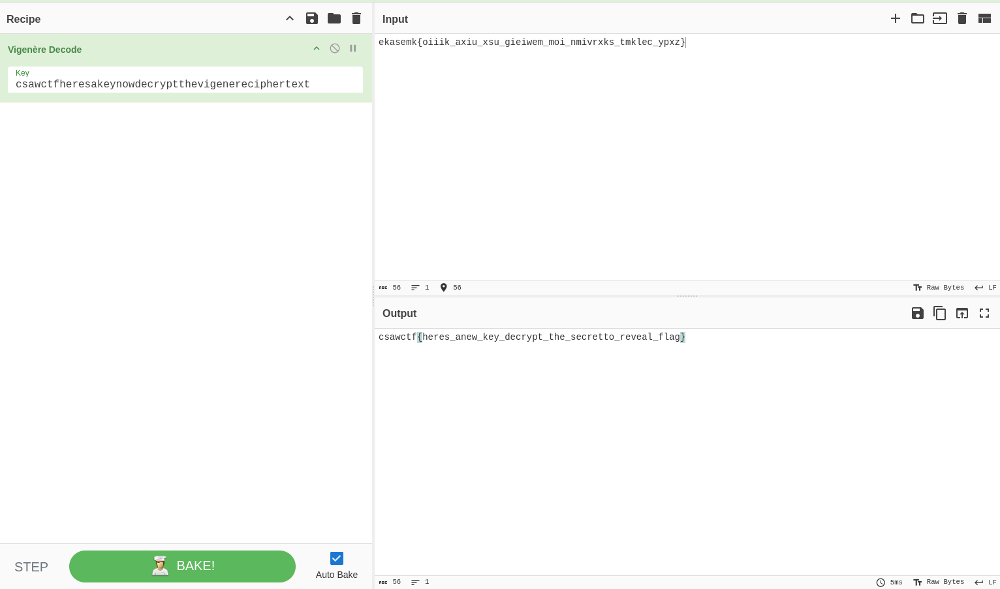
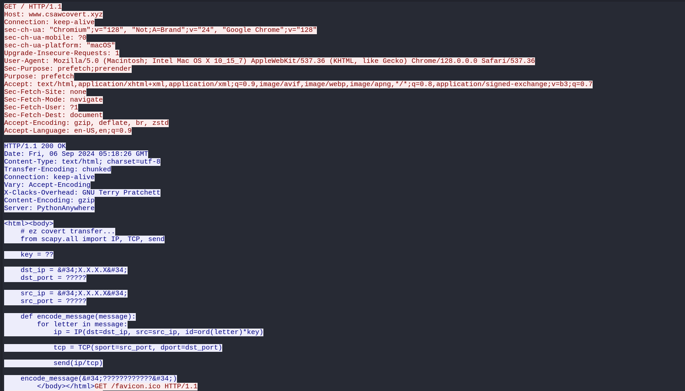
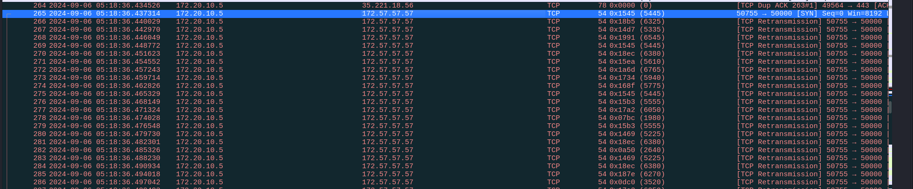

CSAW CTF Qualification Round 2024, three (3) forensics writeups out of five (5).

## ZipZipZip [Forensics]

Solves: `481` Points: `50` Author: `knight_`

Description: `Brighten up at last with the flag`

<a href="/assets/zip/csawctf2024/challenge.zip" class="btn btn-primary" download>
  <i class="fas fa-download"></i> challenge.zip
</a>

<br>

This challenge provides us with a zipfile containing chunks of zips, first chunk is chunk_0.
```
└─$ zipinfo challenge         
Archive:  challenge.zip
Zip file size: 7793947 bytes, number of entries: 1
-rw-a--     3.0 fat  7793702 bx stor 24-Sep-05 19:56 chunk_0.zip
1 file, 7793702 bytes uncompressed, 7793702 bytes compressed:  0.0%
```
Unzipping the challenge zipfile gives chunk_0.zip, which itself contains an additional chunk called chunk_1.zip and a text file chunk_0.txt containing uncomplete data.
```
└─$ zipinfo chunk_0.zip 
Archive:  chunk_0.zip
Zip file size: 7793702 bytes, number of entries: 2
?rw-------  2.0 fat        5 b- stor 24-Sep-06 00:41 chunk_0.txt
-rw-rw-rw-  2.0 fat  7793479 b- stor 24-Sep-06 00:41 chunk_1.zip
2 files, 7793484 bytes uncompressed, 7793484 bytes compressed:  0.0%
```
The idea is clear, unzip recursively all zipfiles and concatenate the uncomplete contents of text files into a single file, to do this, a python script was used.
```python
import os
import zipfile
import shutil

def extract_zip(zip_path, extract_to):
    """ Extract a ZIP file to the specified directory. """
    with zipfile.ZipFile(zip_path, 'r') as zip_ref:
        zip_ref.extractall(extract_to)

def process_chunks(base_path):
    """ Process ZIP files and concatenate text files. """
    result_string = ""
    # Create a queue to manage files and directories to be processed
    queue = [base_path]

    while queue:
        current_path = queue.pop(0)
        
        if not os.path.isdir(current_path):
            # Skip non-directory items (e.g., ZIP files that are being processed)
            continue

        for item in os.listdir(current_path):
            item_path = os.path.join(current_path, item)
            
            if os.path.isfile(item_path):
                if item.endswith('.txt'):
                    with open(item_path, 'r') as file:
                        result_string += file.read() + "\n"  # Concatenate content with newline separator
                elif item.endswith('.zip'):
                    # Extract the new ZIP file directly in the base_path
                    extract_path = os.path.join(base_path, item.replace('.zip', ''))
                    os.makedirs(extract_path, exist_ok=True)
                    extract_zip(item_path, extract_path)
                    # Add the newly extracted files to the queue for processing
                    queue.append(extract_path)
            
            elif os.path.isdir(item_path):
                # Add directories to the queue to process their contents
                queue.append(item_path)
        
        # After processing the current directory, delete it
        if current_path != base_path:
            shutil.rmtree(current_path, ignore_errors=True)

    return result_string

def main():
    # Define paths
    base_dir = './result'  # Use relative path to ensure correct base directory
    challenge_zip = 'challenge.zip'
    
    # Create the result directory if it doesn't exist
    os.makedirs(base_dir, exist_ok=True)
    
    # Extract the initial ZIP file
    extract_zip(challenge_zip, base_dir)
    
    # Process the extracted contents
    result = process_chunks(base_dir)
    
    # Save the result to a file or print it
    with open('final_result.txt', 'w') as result_file:
        result_file.write(result)
    
    print("Processing complete. The result has been saved to 'final_result.txt'.")

if __name__ == "__main__":
    main()
```
The content of final result is base64 encoded, we decode it then check file format.
```
└─$ cat final_result.txt | base64 -d > final_result
└─$ file final_result    
final_result: PNG image data, 1024 x 1024, 8-bit colormap, non-interlaced
```
It's an image, loading it reveals the flag.


Flag: `csawctf{ez_r3cur5iv3ne55_right7?}`

## The Triple Illusion  [Forensics]

Solves: `215` Points: `228` Author: `ScriptKiddo`

Description: `Some things are hidden in plain sight. Use your knowledge of forensics and crypto to solve the challenge`

<a href="/assets/zip/csawctf2024/images.zip" class="btn btn-primary" download>
  <i class="fas fa-download"></i> images.zip
</a>

<br>

Thie time we are provided with a zipfile with three images.
```
└─$ zipinfo images.zip 
Archive:  images.zip
Zip file size: 13975320 bytes, number of entries: 4
drwxrwxr-x  6.3 unx        0 bx stor 24-Sep-07 06:14 images/
-rw-rw-r--  6.3 unx   202140 bx defN 24-Sep-06 19:46 images/datavsmetadata.png
-rw-rw-r--  6.3 unx  1422389 bx stor 24-Sep-05 23:57 images/hibiscus.png
-rw-rw-r--  6.3 unx 12366166 bx defN 24-Sep-05 23:57 images/roses.png
4 files, 13990695 bytes uncompressed, 13974716 bytes compressed:  0.1%
```
Checking the first one's metadata reveals hidden information.
```
└─$ exiftool images/datavsmetadata.png 
ExifTool Version Number         : 12.76
File Name                       : datavsmetadata.png
Directory                       : images
File Size                       : 202 kB
File Modification Date/Time     : 2024:09:06 19:46:15+01:00
File Access Date/Time           : 2024:09:09 15:47:33+01:00
File Inode Change Date/Time     : 2024:09:07 06:14:32+01:00
File Permissions                : -rw-rw-r--
File Type                       : PNG
File Type Extension             : png
MIME Type                       : image/png
Image Width                     : 1400
Image Height                    : 734
Bit Depth                       : 8
Color Type                      : RGB with Alpha
Compression                     : Deflate/Inflate
Filter                          : Adaptive
Interlace                       : Noninterlaced
Pixels Per Unit X               : 2835
Pixels Per Unit Y               : 2835
Pixel Units                     : meters
Exif Byte Order                 : Big-endian (Motorola, MM)
Orientation                     : Horizontal (normal)
Comment                         : Can you crack my secret? Here's a list of numbers: See what they reveal. 0 0 0 0 0 0 0 0 15 23 23 4 7 0 22 1 23 28 0 18 10 12 0 7 23 2 17 18 21 16 0 0 0 0 0 28 7 16 17 16 6 17 11 0 1 0 21 23 4 24 0 0 0 0 0 0
Image Size                      : 1400x734
Megapixels                      : 1.0
```
It seems we need a key to xor with the numbers provided. We check second and third images for hidden data and we find some.
```
└─$ zsteg -a images/roses.png 
b1,rgb,lsb,xy       .. text: "csawctf{heres_akey_now_decrypt_the_vigenere_cipher_text} "
b1,rgb,msb,xy       .. file: OpenPGP Public Key
<SNIP>
└─$ zsteg -a images/hibiscus.png 
imagedata           .. file: shared library
b1,rgb,lsb,xy       .. text: "ekasemk{oiiik_axiu_xsu_gieiwem_moi_nmivrxks_tmklec_ypxz}"
<SNIP>
```
it's vigenere's encryption, CyberChef to the rescue.



We get another key csawctf{heres_anew_key_decrypt_the_secretto_reveal_flag}, this one is for the xor operation, we used a python script once again.
```python
def xor_decode(data, key):
    """ XOR decode with multi-byte key. """
    key_length = len(key)
    return bytes([data[i] ^ key[i % key_length] for i in range(len(data))])

# Convert the string to bytes
string = 'csawctf{heres_anew_key_decrypt_the_secretto_reveal_flag}'
string_bytes = string.encode('utf-8')

# Numbers from the array
numbers = [0, 0, 0, 0, 0, 0, 0, 0, 15, 23, 23, 4, 7, 0, 22, 1, 23, 28, 0, 18, 10, 12, 0, 7, 23, 2, 17, 18, 21, 16, 0, 0, 0, 0, 0, 28, 7, 16, 17, 16, 6, 17, 11, 0, 1, 0, 21, 23, 4, 24, 0, 0, 0, 0, 0, 0]

numbers_bytes = bytes(numbers)

# XOR the string bytes with the numbers bytes
decoded_bytes = xor_decode(string_bytes, numbers_bytes)
try:
    decoded_str = decoded_bytes.decode('utf-8')
    print(f"Decoded result: {decoded_str}")
except UnicodeDecodeError:
    print("Failed to decode the result as UTF-8.")
```
Running it reveals the flag.
```
└─$ python img_decode.py 
Decoded result: csawctf{great_work_you_cracked_the_obscured_secret_flag}
```
Flag: `csawctf{great_work_you_cracked_the_obscured_secret_flag}`

## Covert [Forensics]

Solves: `237` Points: `169` Author: `cpan57`

Description: `It appears there's been some shady communication going on in our network...`

<a href="/assets/zip/csawctf2024/covert.zip" class="btn btn-primary" download>
  <i class="fas fa-download"></i> covert.zip
</a>

<br>

This challenge provides a zipfile containing a pcapng file with key decryption file for TLS traffic.
```
└─$ zipinfo challenge/covert.zip 
Archive:  challenge/covert.zip
Zip file size: 126668 bytes, number of entries: 2
-rw-rw-r--  6.3 unx   134924 bx defN 24-Sep-06 17:03 chall.pcapng
-rw-rw-r--  6.3 unx    69468 bx defN 24-Sep-06 17:03 keys.log
2 files, 204392 bytes uncompressed, 126382 bytes compressed:  38.2%
```
Inspecting http traffic after TLS decryption shows a shady python script being used for communication, it reveals a key of two characters that was used for communication encryption on id field of IP header, the destination ip and source ip used ports of five numbers.



The only suspicious traffic that checks these conditions is this one in red which means suspected retransmission.



A python script was used to brute force the key to get the flag.
```python
import itertools
from scapy.all import rdpcap, IP, TCP

# Load the PCAP file
packets = rdpcap('<REDACTED>/chall.pcapng')

# Collect all non-zero IP IDs into an array
ip_ids = []

for packet in packets:
    if IP in packet and TCP in packet:
        if packet[IP].id != 0:  # ip.id != 0
            if packet[IP].src == "172.20.10.5" and packet[IP].dst == "172.57.57.57":  # IP source and destination match
                ip_ids.append(packet[IP].id)
print("length: ",len(ip_ids))
# Define a function to decode using a brute-forced two-byte key
def decode_ids(ip_ids, key1, key2):
    decoded_message = ''
    for ip_id in ip_ids:
        try:
            # Use both parts of the key
            decoded_char = chr(ip_id // (key1 * key2))  # Assuming ord(letter) * key1 * key2 = ip.id
            decoded_message += decoded_char
        except:
            continue
    return decoded_message

# Brute-force possible two-character keys and look for a specific pattern
def brute_force_key(ip_ids):
    # Generate all possible two-character key combinations (1-255 for both)
    for key1, key2 in itertools.product(range(1, 256), repeat=2):
        decoded_message = decode_ids(ip_ids, key1, key2)
        if "csaw" in decoded_message:  # Look for the known flag pattern
            print(f"Key found: {key1}, {key2}")
            print(f"Decoded message: {decoded_message}")
            break

# Execute the brute-force attack
brute_force_key(ip_ids)
```
Running it reveals the flag.
```
└─$ python challenge/dec.py 
length:  41
Key found: 1, 55
Decoded message: csawctf{licen$e_t0_tr@nsmit_c0vertTCP$$$}
```

Flag: `csawctf{licen$e_t0_tr@nsmit_c0vertTCP$$$}`