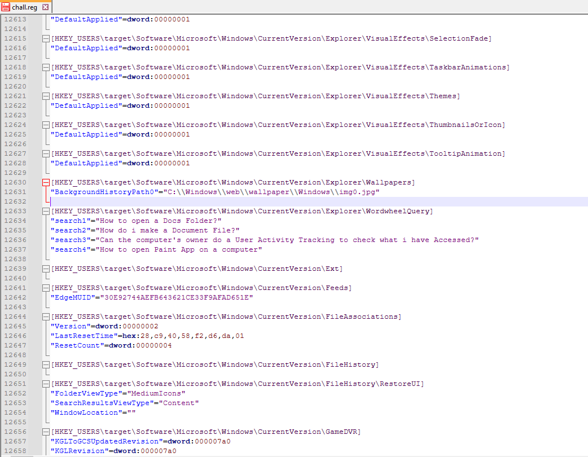
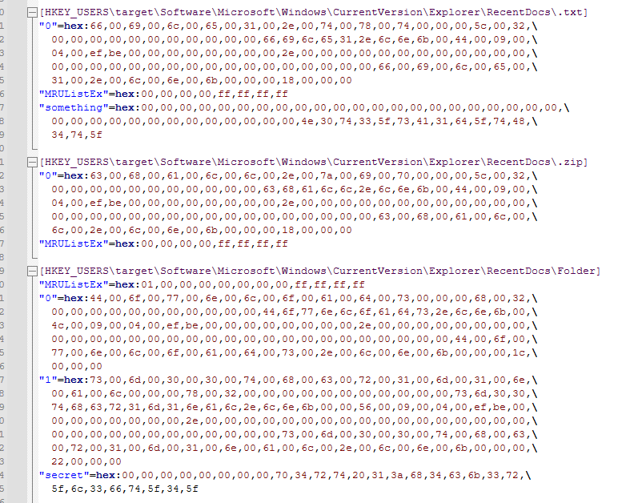
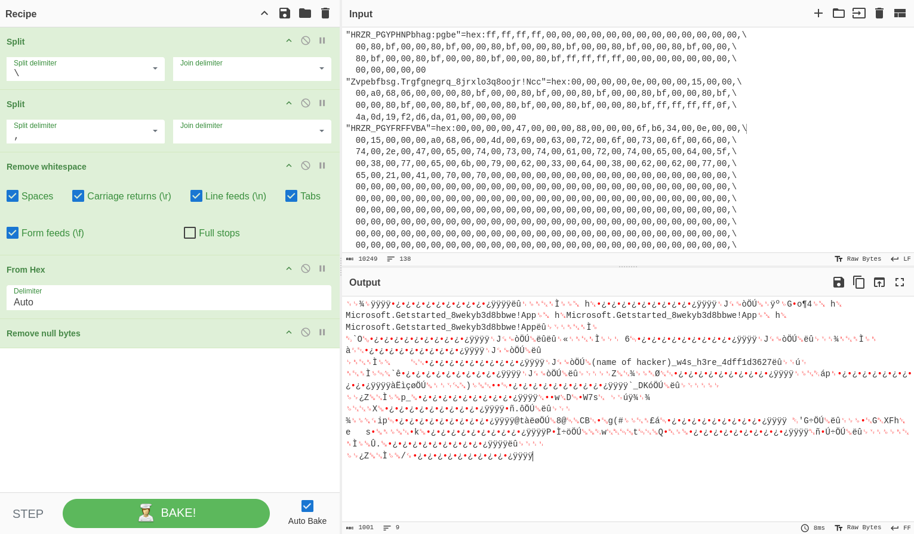
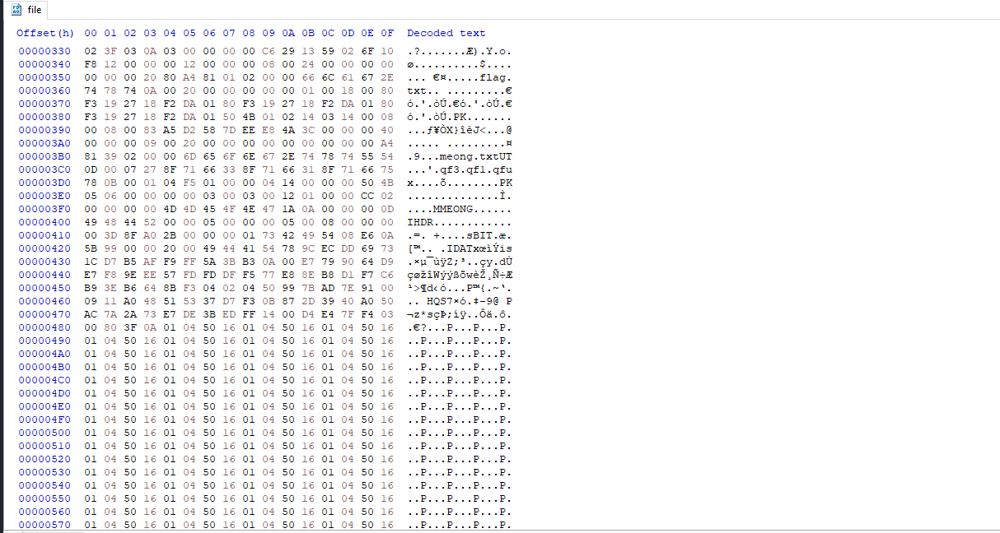
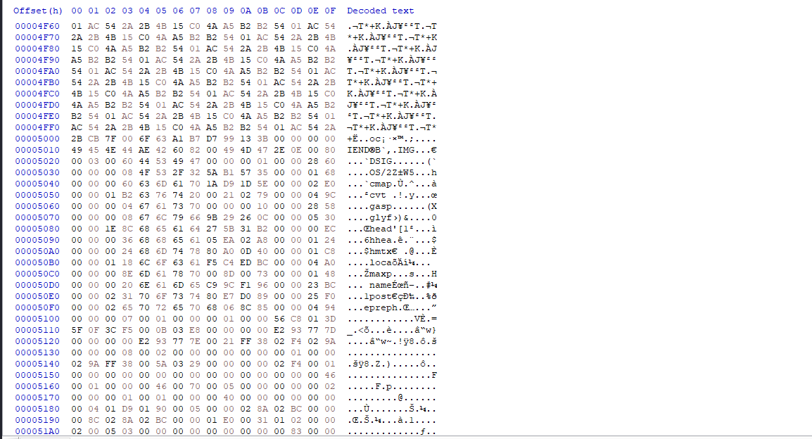
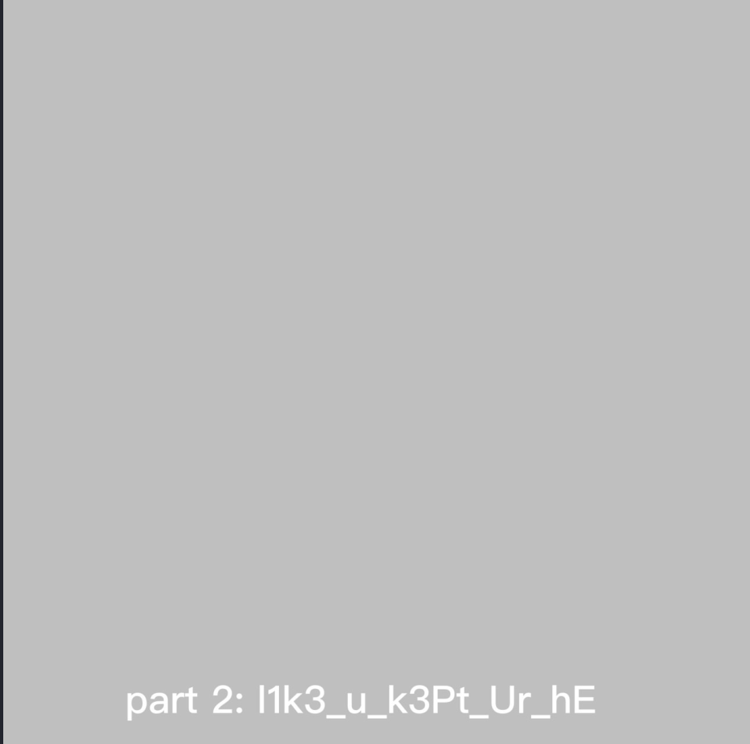
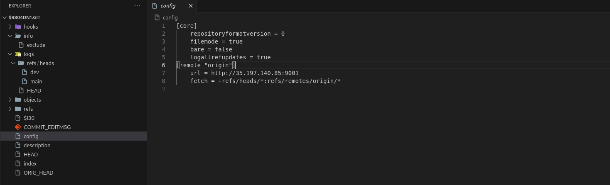
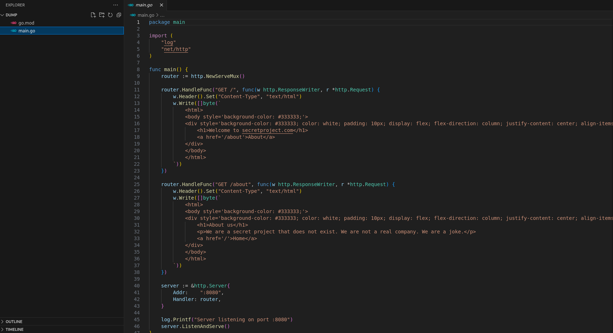

A CTF event organized by Computer Science students of Universitas Indonesia. Three forensics writeups.

## the dumb hacker [Forensics]

Solves: `15` Points: `469` Author: `ultradiyow`

Description: `Someone broke into my house and used my computer! Whoever they are, I don’t think they’re very smart.. They left the browser open. Can you figure out what they did to my computer?`

<a href="/assets/zip/compfest2024/the_dumb_hacker.zip" class="btn btn-primary" download>
  <i class="fas fa-download"></i> the_dumb_hacker.zip
</a>

<br>

We are provided with a registry file.
```
└─$ zipinfo the_dumb_hacker.zip 
Archive:  the_dumb_hacker.zip
Zip file size: 231679 bytes, number of entries: 4
drwxrwxr-x  6.3 unx        0 bx stor 24-Sep-08 06:34 the_dumb_hacker/
drwxrwxr-x  6.3 unx        0 bx stor 24-Sep-08 06:34 the_dumb_hacker/__MACOSX/
-rw-rw-r--  6.3 unx      276 bx defN 24-Sep-06 12:08 the_dumb_hacker/__MACOSX/._chall.reg
-rw-rw-r--  6.3 unx  2484730 bx defN 24-Sep-06 12:08 the_dumb_hacker/chall.reg
4 files, 2485006 bytes uncompressed, 231005 bytes compressed:  90.7%
```
We begin by checking key registry keys like the one hinted in challenge's description.



We deduce from the hacker's browser search has maybe accessed a text file and a folder. To check we query for registry key HKEY_USERS\target\Software\Microsoft\Windows\CurrentVersion\Explorer\RecentDocs

We find two unusual subkeys for registry subkeys ".txt" "Folder".



something in ascii is N0t3_sA1d_tH4t_ , secret is p4rt 1:h4ck3r_l3ft_4_ , We get two parts of flag which are hinting towards a note left by hacker. We need to check UserAssist reg key, which is a feature in Windows that tracks the usage of executable files and applications launched by the user; HKEY_USERS\target\Software\Microsoft\Windows\CurrentVersion\Explorer\UserAssist

We find an entry in HKEY_USERS\target\Software\Microsoft\Windows\CurrentVersion\Explorer\UserAssist\{F4E57C4B-2036-45F0-A9AB-443BCFE33D9F}, decoding it reveals the last part of flag.



Flag: `COMPFEST16{h4ck3r_l3ft_4_N0t3_sA1d_tH4t_sm00thcr1m1nal_w4s_h3re}`

##  head's up! [Forensics]

Solves: `12` Points: `481` Author: `ultradiyow`

Description: `Oh no! My mischievous cat decided to play with my laptop and now all my important files are missing! The only thing left is this single, mysterious file. Can you help me retrieve all my important files?`

<a href="/assets/zip/compfest2024/heads_up.zip" class="btn btn-primary" download>
  <i class="fas fa-download"></i> heads_up.zip
</a>

<br>

This challenge provides a zipfile.
```
└─$ zipinfo heads_up/heads_up.zip 
Archive:  heads_up/heads_up.zip
Zip file size: 24303 bytes, number of entries: 2
-rw-r--r--  2.0 unx    30848 bX defN 24-Aug-19 10:24 file
-rw-r--r--  2.0 unx     1608 bX defN 24-Aug-19 10:24 __MACOSX/._file
```
Inside we find another zipfile.
```
└─$ file heads_up/file
heads_up/file: Zip archive data, at least v2.0 to extract, compression method=deflate
└─$ zipinfo heads_up/file 
Archive:  heads_up/file
Zip file size: 30848 bytes, number of entries: 3
-rw-r--r--  2.0 unx      635 bX defN 24-Jun-18 14:35 __MACOSX/._flag.txt
-rw-r--r--  6.3 unx       18 bx stor 24-Aug-19 05:14 flag.txt
-rw-r--r--  2.0 unx       64 bX defN 24-Jun-18 14:44 meong.txt
3 files, 717 bytes uncompressed, 494 bytes compressed:  31.1%
```
The challenge hinted towards corrupted headers, to check, we inspect the hex data on a hexeditor. We find two interesting headers besides the zip header, MMEONG, IMG.





We alter the first one to be PNG and second one to an OTTO font header. Using a python script we get the rest of the flag besides first part flag.txt (COMPFEST16{lO0kS_).



Found 4D_uP!_22a4b9dbf7} in font file.

Flag: `COMPFEST16{lO0kS_l1k3_u_k3Pt_Ur_hE4D_uP!_22a4b9dbf7}`

## loss [Forensics]

Solves: `10` Points: `488` Author: `k3ng`

Description: `lmao i just rm -rf 'ed my usb drive. help me out plz.`

<a href="/assets/zip/compfest2024/chall" class="btn btn-primary" download>
  <i class="fas fa-download"></i> chall
</a>

<br>

Here, we are provided with en EnCase image, loading it on FTK imager reveals a deleted git repository in recyclebin, we recover it and check the contents.



A remote github server was used, we try to retrieve the original github repository since the current one is corrupted using [git-dumper](https://github.com/arthaud/git-dumper).

The remote server employed rate limiting on cloning requests, this was bypassed by slow requests 2 reqs/s.

After retrieving the .git folder and repo's files, it seems to be a go server.



We check git logs to find out the commits pushed by contributor.
```
└─$ git log
commit fc8bf86f572ccdff7bbe7d2e2f2f5f49cd108105 (HEAD -> dev)
Author: Muhammad Oka <oka@muhammadoka.dev>
Date:   Thu Jun 13 21:58:11 2024 +0700

    FORGOT TO REMOVE

commit c11b24f6d400f096d897ef47a3006645ae9e5857
Author: Muhammad Oka <oka@muhammadoka.dev>
Date:   Thu Jun 13 21:57:53 2024 +0700

    add link back to about page

commit 7b1498ee16380e4db42abe28aa4f16d2b0374382 (main)
Author: Muhammad Oka <oka@muhammadoka.dev>
Date:   Thu Jun 13 21:55:40 2024 +0700

    about page

commit e6b3203ddbc0b624994184c296dd672e8a8a0471
```
We check the commit before redacting what was written on "FORGOT TO REMOVE" to find the flag.
```
└─$ git diff c11b24f6d400f096d897ef47a3006645ae9e5857
diff --git a/main.go b/main.go
index 9655361..61102d5 100644
--- a/main.go
+++ b/main.go
@@ -30,7 +30,7 @@ func main() {
                        <div style='background-color: #333333; color: white; padding: 10px; display: flex; flex-direction: column; justify-content: center; align-items: center; height: 100%;'>
                                <h1>About us</h1>
                                <p>We are a secret project that does not exist. We are not a real company. We are a joke.</p>
-                               <a href='/'>COMPFEST16{g0D_bl3Ss_L1nU5_t0RV4ldS_7f3c45c4dc}Home</a>
+                               <a href='/'>Home</a>
                        </div>
                        </body>
                        </html>
```

Flag: `COMPFEST16{g0D_bl3Ss_L1nU5_t0RV4ldS_7f3c45c4dc}`