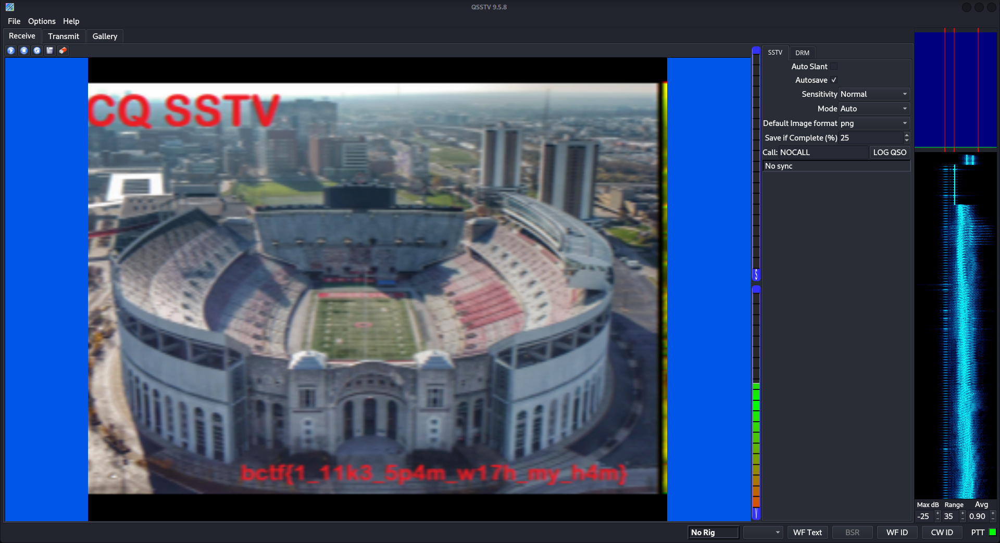
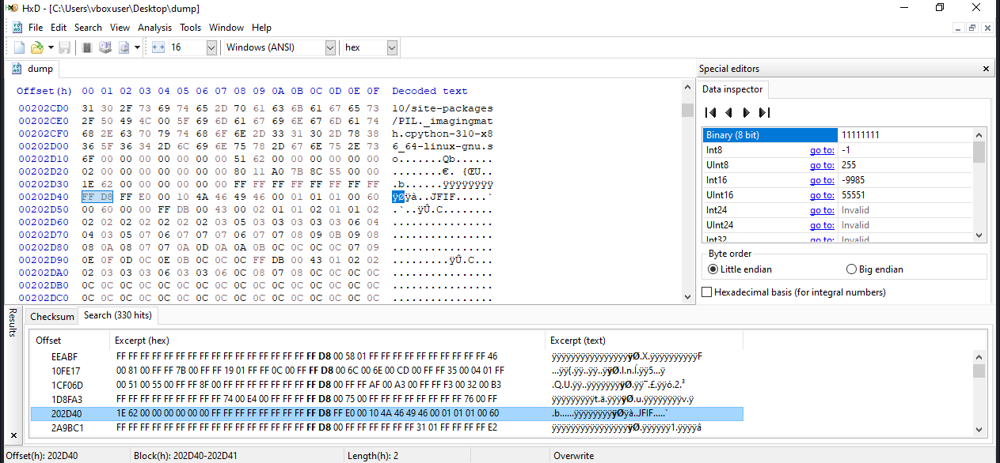
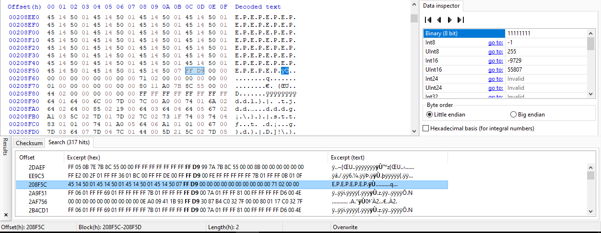
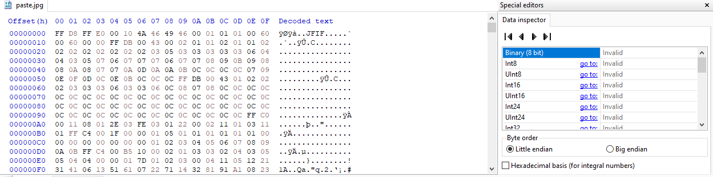
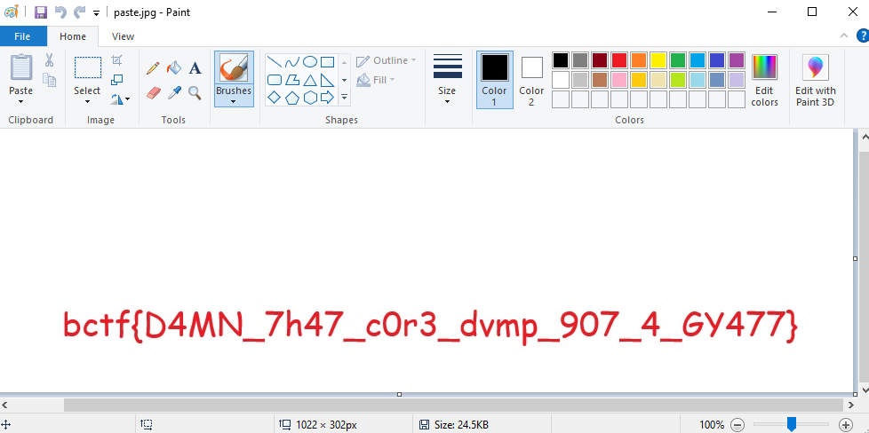
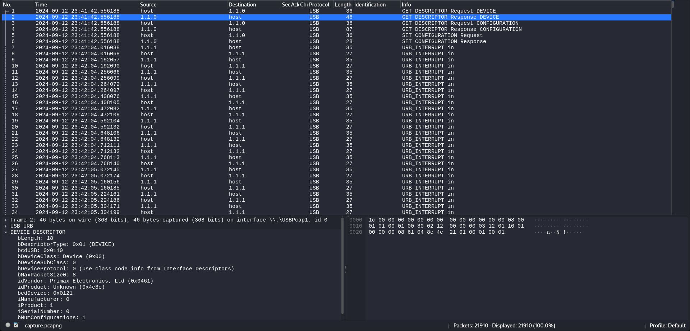
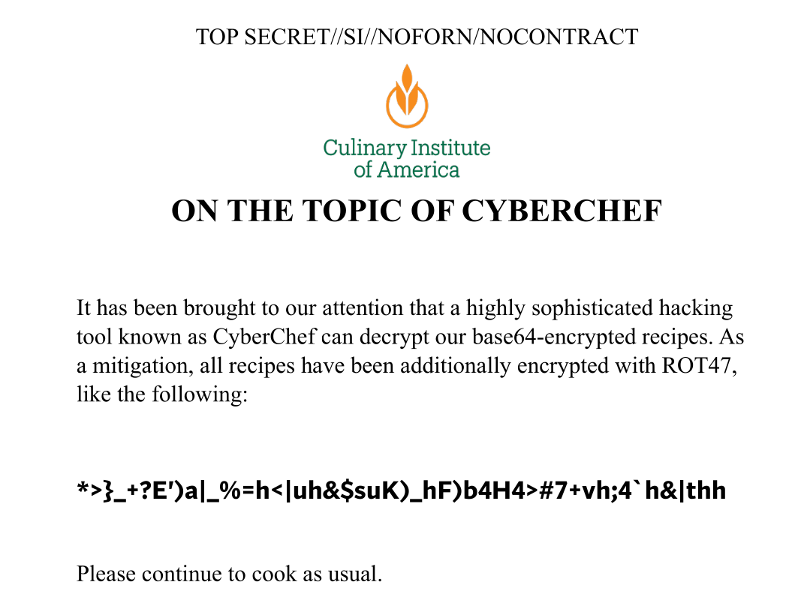
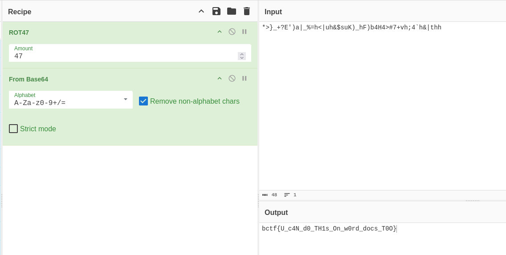

CTF run by students and alumni from Cyber Security Club @ Ohio State.
BuckeyeCTF is intended to be beginner-friendly and is geared towards university teams, but there will be a wide range of difficulty.

## unknown [Forensics]

Solves: `380` Points: `10` Author: `mbund`

Description: `Some may call this junk. Me, I call them treasures.`

<a href="/assets/zip/buckeyectf2024/unknown.zip" class="btn btn-primary" download>
  <i class="fas fa-download"></i> unknown.zip
</a>

<br>

This was a beginner challenge. We are provided with a zip file.
```
└─$ file unknown.zip               
unknown.zip: gzip compressed data, from Unix, original size modulo 2^32 10240
```
Extracting it gives another tar file.
```
└─$ file unknown 
unknown: POSIX tar archive (GNU)
```
Once this Tar file's contents are extracted we get the flag.
```
└─$ cat unknown\ \(2\)/flag.txt 
bctf{f1l3_3x73n510n5_4r3_n07_r34l}
```

Flag: `bctf{f1l3_3x73n510n5_4r3_n07_r34l}`

## couch potato [Forensics]

Solves: `93` Points: `100` Author: `auska`

Description: `I am a real american, down to my favorite pastime!`

<a href="/assets/zip/buckeyectf2024/dump.wav" class="btn btn-primary" download>
  <i class="fas fa-download"></i> dump.wav
</a>

<br>

We are provided with a Waveform Audio file. The title and description of challenge suggests this audio file is tv related. So launching QSSTV which is a tool for receiving and transmiting images over radio using analog SSTV or digital DRM, then loading the audio file prints the image.



Flag: `bctf{1_11k3_5p4m_w17h_my_h4m}`

## wreck [Forensics]

Solves: `62` Points: `100` Author: `gsemaj`

Description: `I hate when my ship crashes`

<a href="/assets/zip/buckeyectf2024/dump" class="btn btn-primary" download>
  <i class="fas fa-download"></i> dump
</a>

<br>

We are provided with a python core dump file.
```
└─$ file dump   
dump: ELF 64-bit LSB core file, x86-64, version 1 (SYSV), SVR4-style, from 'python3 wreck.py', real uid: 1000, effective uid: 1000, real gid: 1000, effective gid: 1000, execfn: '/usr/bin/python3', platform: 'x86_64'
```
Inspecting its hexdump for interesting headers, reveals a jfif header.



We get the start marker's offset as well as the end marker's offset.



We copy and paste in between content to a newly created hexdump and save as jpg file.



Opening the file shows the flag.



Flag: `bctf{D4MN_7h47_c0r3_dvmp_907_4_GY477}`

## duck-pics [Forensics]

Solves: `171` Points: `100` Author: `rene`

Description: `got a capture on the chall author while engaging in "personal matters". see what you can find.`

<a href="/assets/zip/buckeyectf2024/capture.pcapng" class="btn btn-primary" download>
  <i class="fas fa-download"></i> capture.pcapng
</a>

<br>

We are provided with a pcapng file. Inspecting packets reveals USB HID data is being trasnmitted from a keyboard.



We extract all the hid data on a file to be ready for parsing.
```
└─$ tshark -r ./capture.pcapng -Y 'frame.len == 35' -T fields -e usbhid.data | sed 's/../:&/g2' > usbPcapData
```
Using this [usb-keyboard-parser](https://github.com/TeamRocketIst/ctf-usb-keyboard-parser), we are able to decode what was typed.

```
└─$ python usbkeyboard.py usbPcapData
Blog entry #216

Title: The Strange and unsettling Reality ofDucks' Spiral-ShapePenises.

There are some facts you stumvle uppon in life that leave you changed.  I'm not talking about grand revelations like realizing the meaning of existence, but rather those little, often unwanted, tidbits of knowledge that somehow manage to worm theirway into your brain and stay there.  Forever.....  For me, one of thoss facts is this: ducks have spiral-shaped penieses.

Now, before you click away, thinking this is some sort of absurd prank or outlandish clickbait-let me assure yu, this is real. *Too** real, if I may say.  Ducks, those quaint little creatures that waddle by ponds and quack at passersby, have genitalia that corkscrew in way I never thought possible or necessary. The first time I learned about this, my immediate response was a bewildered wh"why?" followed by a slow creeping discomfort that I havn't been able to shake off since.

I suppose the first question we should all ask is, "How did I even come across this information?"  Well, like all unexpected journeys, it began innocently enogh. I was deep into an internet rabbit hole one evening, starting with wholesome videos of duckligs learning to swim. That should have been my cue to stop. But the curiosity machine that is the internet is relentless, and after clicking from one nature documentary to another, I stumbled upon the unsettling fact that male ducks, SPECIFICALL drakes, have penises that are shaped like corkscrews.

At first,  I didn't believe it.  I mean, why would a duck's reproductive organ *nee* to resemble soething you open a bottle of wine??? It felt like one of those quirky, unnecessary adaptations that evolution sometimes comes up with for reasons that no one really asked for. but the more I read  (and I readALOT), the more uncomforatble  I became.  I couldn't stop imagining it.

[CAPSLOCK][CAPSLOCK][CAPSLOCK]magine ducks waddling around, their spiral-shaped anatomy hidden beneath those seeminglt innocent feathers, waiting for just the right moment,  It's bizarrely elaborate for a bird, considering that mst birds don't even *have8* penises.  They make do with something called a cloacal kiss, where their reproductive organs briefly touch. Ducks, on the other hand, went the extra miile with a complex, coiled machanism. It's almost as if nature, in some strange fit of whimsy said, "You know what ducks need?  A penis that looks like a piece of pasta."

But it doesn't stop there. Oh no. As if the spiral shape wasn't unsettling enough, the whole process of duck reproduction is fraught with weirdness and, frankly, bioviolence.  Female ducks, it turns out, evolved a counter-spiral that's rigreproductive tract to fend off unwanted advances, because yes, the duck world is rife with reproductive coercion. That's right-nature designed an entire system where male and female anatomy are *at odds* with each other, spiraling in opposite directtions, all in the name of, wwll, survival?

So now, every time I see a duck floating gracefully across a pong, I cn't help but feel a little uneasy,.  On the surface, they seem calm, composed, and perfectly harmless. But now that I know what's going on beneath thoss features, I can't unsee it. The piral-shped tspiral-shaped truth is always there, lurking in the background. and honestly, it makes my interactions with ducks,,, awkward. I mean, how am I supposed to look at them the same way again?

                                Tenterthefentertheflag.com


bctf{SSteASt0p_s3nd1Ng_m3_DuCK_p1c$}

                I think what makes it particularly uncomforatble is the juxtaposition between the image we have of ducks and this peculiar biological fact.  Ducks are often associated with peaceful, picturesque moments.  You feed them bread crumbs in the park.  You watch them swim in calm, srene pongs. And then there's this SPIRAL PENIS SITUATION* lurking thajust under the surface  (literally and figuratively....).

This revelation has caused me to question a lot of thigs, Is nature inherently weird? Are there more unsettling facts about animals I don't know yet-and do I event  *want* to know? Could  I have gone my whole life without knowing this about ducks, and would I be happier for it?

In the end, there's no real resolution here, no epiphany that wraps this uncomfortable fact into a neat little bow. Ducks have spiral-shaped penises, and that's just how the world works. But even as I sit here writing this, with me words than necessary on a subject I never intended to delve into, I ca't shake the deeling that something has shifted in my understanding of the animal kingdom, nature, and life.

So the next time you see a duck gliding elegantly across a lake, just remember: beneath that calm exterior is a corkscrew of evolutionary weirdness that will haunt you forever.
```
The accepted flag starts with St0p word.

Flag: `bctf{St0p_s3nd1Ng_m3_DuCK_p1c$}`

## reduce_recycle [Forensics]

Solves: `38` Points: `269` Author: `corgo`

Description: `I forgot the randomly generated 12-character password I used to encrypt these files.... is there anything you can do to help me get my flag back??`

<a href="/assets/zip/buckeyectf2024/dogs_wearing_tools.zip" class="btn btn-primary" download>
  <i class="fas fa-download"></i> dogs_wearing_tools.zip
</a>

<a href="/assets/zip/buckeyectf2024/important_flags.7z" class="btn btn-primary" download>
  <i class="fas fa-download"></i> important_flags.7z
</a>

<br>

We are provided with two files, one a zip the other is a 7z. We check their encryptions and search for the one that is weak or obsolete. Bear in mind they have the same password.
```
└─$ 7z l -slt dogs_wearing_tools.zip           

7-Zip 23.01 (x64) : Copyright (c) 1999-2023 Igor Pavlov : 2023-06-20
 64-bit locale=C.UTF-8 Threads:16 OPEN_MAX:1024

Scanning the drive for archives:
1 file, 4954033 bytes (4838 KiB)

Listing archive: dogs_wearing_tools.zip

--
Path = dogs_wearing_tools.zip
Type = zip
Physical Size = 4954033

----------
Path = 1.png
Folder = -
Size = 1817550
Packed Size = 1817562
Modified = 2024-09-02 01:38:05.2575183
Created = 
Accessed = 
Attributes = A
Encrypted = +
Comment = 
CRC = 346673B4
Method = ZipCrypto Store
Characteristics = NTFS : Encrypt
Host OS = FAT
Version = 20
Volume Index = 0
Offset = 0

Path = 2.png
Folder = -
Size = 1830967
Packed Size = 1830979
Modified = 2024-09-02 01:38:14.0122732
Created = 
Accessed = 
Attributes = A
Encrypted = +
Comment = 
CRC = 0FE18EE0
Method = ZipCrypto Store
Characteristics = NTFS : Encrypt
Host OS = FAT
Version = 20
Volume Index = 0
Offset = 1817597

Path = 3.png
Folder = -
Size = 94416
Packed Size = 94428
Modified = 2024-09-02 01:38:19.0506165
Created = 
Accessed = 
Attributes = A
Encrypted = +
Comment = 
CRC = 9C62018F
Method = ZipCrypto Store
Characteristics = NTFS : Encrypt
Host OS = FAT
Version = 20
Volume Index = 0
Offset = 3648611

Path = 4.png
Folder = -
Size = 1210542
Packed Size = 1210554
Modified = 2024-09-02 01:36:15.1710446
Created = 
Accessed = 
Attributes = A
Encrypted = +
Comment = 
CRC = BA690F9B
Method = ZipCrypto Store
Characteristics = NTFS : Encrypt
Host OS = FAT
Version = 20
Volume Index = 0
Offset = 3743074
```

```
└─$ 7z l -slt important_flags.7z    

7-Zip 23.01 (x64) : Copyright (c) 1999-2023 Igor Pavlov : 2023-06-20
 64-bit locale=C.UTF-8 Threads:16 OPEN_MAX:1024

Scanning the drive for archives:
1 file, 186 bytes (1 KiB)

Listing archive: important_flags.7z

--
Path = important_flags.7z
Type = 7z
Physical Size = 186
Headers Size = 138
Method = Copy 7zAES
Solid = -
Blocks = 1

----------
Path = flag.txt
Size = 33
Packed Size = 48
Modified = 2024-09-19 02:32:35.2215184
Attributes = A
CRC = A3535653
Encrypted = +
Method = Copy 7zAES:19
Block = 0
```
The command results show that the zipfile is using a ZipCrypto Store. This is considered old encryption. To crack the zipfile we can use [bkcrack](https://github.com/kimci86/bkcrack). It suffices and requires to know first 12 bytes of the to-be decrypted file, lucky us we got png files inside which have known magic bytes. By calculating the chunk size and adding PNG IHDR markers, we make up the known bytes into a file.

```
└─$ echo -n '\x89\x50\x4E\x47\x0D\x0A\x1A\x0A\x00\x00\x00\x0D\x49\x48\x44\x52' > plain.txt
```
Then, we procedd by cracking the zip's keys.
```
└─$ bkcrack-1.7.0-Linux/bkcrack -C dogs_wearing_tools.zip -c 3.png -p plain.txt  
bkcrack 1.7.0 - 2024-05-26
[18:53:21] Z reduction using 9 bytes of known plaintext
100.0 % (9 / 9)
[18:53:21] Attack on 744092 Z values at index 6
Keys: adf73413 6f6130e7 0cfbc537
69.1 % (514233 / 744092)
Found a solution. Stopping.
You may resume the attack with the option: --continue-attack 514233
[18:30:35] Keys
adf73413 6f6130e7 0cfbc537
```
Once the keys are known, it is possible to bruteforce the password.
```
└─$ bkcrack-1.7.0-Linux/bkcrack -k adf73413 6f6130e7 0cfbc537 -r 12 ?p 
bkcrack 1.7.0 - 2024-05-26
[18:35:04] Recovering password
length 0-6...
length 7...
length 8...
length 9...
length 10...
length 11...     
length 12...         
Password: 2n3Ad3&ZxDvV
19.8 % (1789 / 9025)
Found a solution. Stopping.
You may resume the password recovery with the option: --continue-recovery 326e39202020
[18:35:21] Password
as bytes: 32 6e 33 41 64 33 26 5a 78 44 76 56 
as text: 2n3Ad3&ZxDvV
```
Extracting the 7z file using the password reveals the flag.
```
└─$ cat flag.txt
bctf{wH1ch_d0g_w4s_youR_FaVOr1t3}
```

Flag: `bctf{wH1ch_d0g_w4s_youR_FaVOr1t3}`

## the_CIA [Forensics]

Solves: `36` Points: `293` Author: `corgo`

Description: `I was handed this top-secret CIA document, but I've been told the password on it isn't crackable. The document seems pretty old, maybe there's a different way to open it..? Author note: Competitors with very slow computers may have some struggle with this challenge. To help speed things up: the first byte is b8 (you'll know what this means later)`

<a href="/assets/zip/buckeyectf2024/protected-cia-document.pdf" class="btn btn-primary" download>
  <i class="fas fa-download"></i> protected-cia-document.pdf
</a>

<br>

We are provided with a password protected pdf file. This is a straightforward challenge because it also uses a weak encryption scheme.
```
└─$ exiftool protected-cia-document.pdf 
ExifTool Version Number         : 12.76
File Name                       : protected-cia-document.pdf
Directory                       : .
File Size                       : 117 kB
File Modification Date/Time     : 2024:09:30 17:23:23+01:00
File Access Date/Time           : 2024:09:30 17:23:23+01:00
File Inode Change Date/Time     : 2024:09:30 17:23:23+01:00
File Permissions                : -rw-rw-r--
File Type                       : PDF
File Type Extension             : pdf
MIME Type                       : application/pdf
PDF Version                     : 1.7
Linearized                      : No
Encryption                      : Standard V1.2 (40-bit)
User Access                     : Print, Modify, Copy, Annotate, Fill forms, Extract, Assemble, Print high-res
Warning                         : Document is password protected (use Password option)
```
RC40 encryption is considered old and weak. First we construct the pdf hash.
```
└─$ pdf2john protected-cia-document.pdf > pdf_hash
└─$ cat pdf_hash 
protected-cia-document.pdf:$pdf$1*2*40*-4*1*16*f1707cb82f3dbf48b43ba62b159dd92f*32*ec946c5b13a86b1e83ace77cae236219520f343c318080a08b5032fed386c369*32*3e6bcb942137ae9c4d3530581158fc277eeb794952f3ceaa76389183fa5dda55
```
Then we crack it using hashcat since we know the first byte. This is faster since it uses GPU but during the CTF i actually used and modified the c file in [RC4-40-brute-pdf](https://github.com/kholia/RC4-40-brute-pdf). but we get same results.
```
$pdf$1*2*40*-4*1*16*f1707cb82f3dbf48b43ba62b159dd92f*32*ec946c5b13a86b1e83ace77cae236219520f343c318080a08b5032fed386c369*32*3e6bcb942137ae9c4d3530581158fc277eeb794952f3ceaa76389183fa5dda55:b895821f14
                                                          
Session..........: hashcat
Status...........: Cracked
Hash.Mode........: 10410 (PDF 1.1 - 1.3 (Acrobat 2 - 4), collider #1)
Hash.Target......: $pdf$1*2*40*-4*1*16*f1707cb82f3dbf48b43ba62b159dd92...5dda55
Time.Started.....: Mon Sep 30 20:12:07 2024 (17 secs)
Time.Estimated...: Mon Sep 30 20:12:24 2024 (0 secs)
Kernel.Feature...: Optimized Kernel
Guess.Mask.......: b8?b?b?b?b [5]
Guess.Queue......: 1/1 (100.00%)
Speed.#1.........: 19586.0 kH/s (1.78ms) @ Accel:1024 Loops:1 Thr:32 Vec:1
Recovered........: 1/1 (100.00%) Digests (total), 1/1 (100.00%) Digests (new)
Progress.........: 338165760/4294967296 (7.87%)
Rejected.........: 0/338165760 (0.00%)
Restore.Point....: 337641472/4294967296 (7.86%)
Restore.Sub.#1...: Salt:0 Amplifier:0-1 Iteration:0-1
Candidate.Engine.: Device Generator
Candidates.#1....: $HEX[b86172396b] -> $HEX[b8ffff2727]
Hardware.Mon.#1..: Temp: 60c Util: 98% Core:1875MHz Mem:4001MHz Bus:16
```
We got b895821f14 as cracked hash password. We now open the pdf using qpdf. It is also possible to use 10420 mode of hashcat to crack this hash plain's password, but this is more direct.
```
└─$ qpdf --password=b895821f14 --password-is-hex-key --decrypt protected-cia-document.pdf result.pdf
```
The unprotected pdf gives away additional decryption to perform to get the flag.



CyberChef is always handy in these situations.



Flag: `bctf{U_c4N_d0_TH1s_On_w0rd_docs_T0O}`
