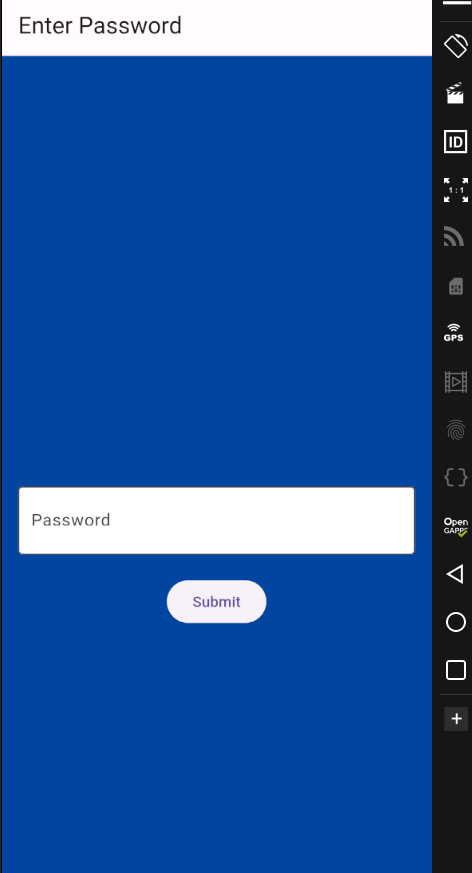
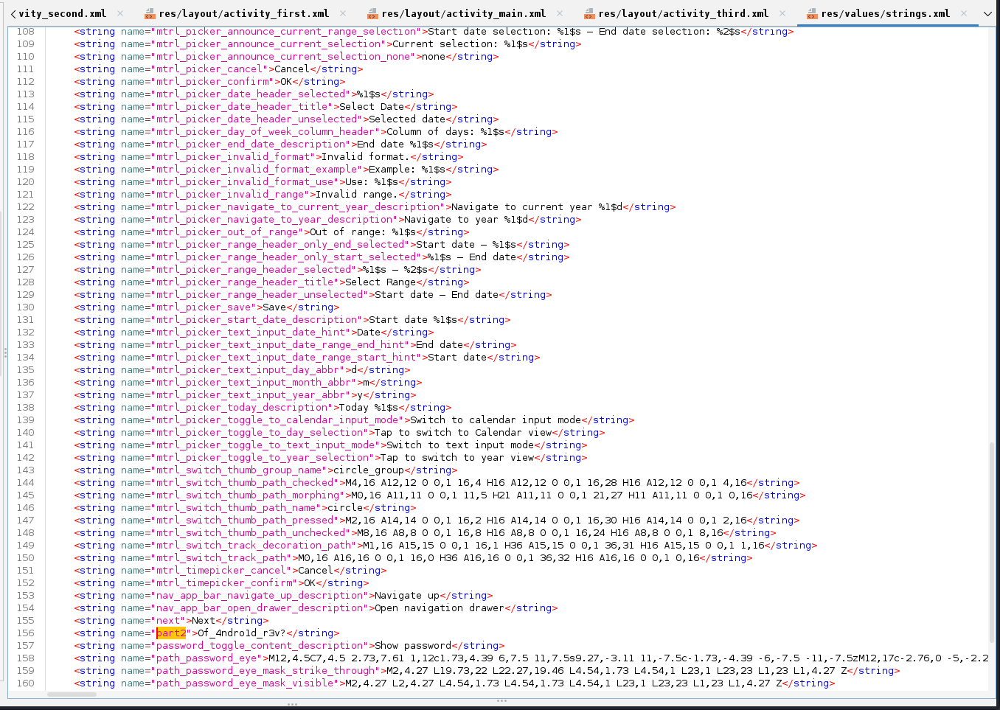

Inaugural edition of IRON CTF (Intrusion Reconnaissance and Offensive Navigation CTF)!
Team 1nf1n1ty from SASTRA Deemed University invites all to embark on an exciting online Jeopardy-style Capture the Flag challenge. 

## Random Pixels  [Forensics]

Solves: `141` Points: `375` Author: `OwlH4x`

Description: `My Image accidently fell into a pixel mixer can you help me recover it?`

We are provided with two files, an encrypted png image and python encryption script.

```python
import random, time, numpy
from PIL import Image
from secret import FLAG

def randomize(img, seed):
	random.seed(seed)
	new_y = list(range(img.shape[0]))
	new_x = list(range(img.shape[1]))
	random.shuffle(new_y)
	random.shuffle(new_x)

	new = numpy.empty_like(img)
	for i, y in enumerate(new_y):
		for j, x in enumerate(new_x):
			new[i][j] = img[y][x]
	return numpy.array(new)


if __name__ == "__main__":
	with Image.open(FLAG) as f:
		img = numpy.array(f)
		out = randomize(img, int(time.time()))
		image = Image.fromarray(out)
		image.save("encrypted.png")
```


The decryption was done using the following python script. Notice the fixed UTC epoch seed extracted from `exiftool encrypted.png`'s modification time (File Modification Date/Time     : 2024:10:02 22:02:40+01:00)
```python
import random, time, numpy
from PIL import Image

def randomize(img):
    random.seed(1727902960)
    old_y = list(range(img.shape[0]))
    old_x = list(range(img.shape[1]))
    
    random.shuffle(old_y)
    random.shuffle(old_x);print(old_y);print(old_x)
    new = numpy.empty_like(img)
    for i, y in enumerate(old_y):
        for j, x in enumerate(old_x):
            new[y][x] = img[i][j]
    return numpy.array(new)


if __name__ == "__main__":
    with Image.open('encrypted.png') as f:
        img = numpy.array(f)
        out = randomize(img)
        image = Image.fromarray(out)
        print(image)
        image.save("dec.png")
```
It decrypts the image and gets us a qr code which when read gives the flag.


Flag: `ironCTF{p53ud0_r4nd0m_f0r_4_r3450n}`

## Game of Hunt [Forensics]

Solves: `113` Points: `420` Author: `tasarmays`

Description: `A Cryptic Voyage`

Flag: ``

## Uncrackable Zip [Forensics]

Solves: `26` Points: `496` Author: `AbdulHaq`

Description: `I forgot to ask my friend for the password to access the secret webpage, and now he's unavailable. I've tried guessing the password, but it's been unsuccessful. My friend is very security-conscious, so he wouldn't use an easy-to-guess password. He's also an Emmet enthusiast who relies heavily on code generation shortcuts. Can you help me figure out how to access the secret webpage?`

Flag: ``

## Fire in the Base Camp [Mobile]

Solves: `85` Points: `455` Author: `p3rplex3d`

Description: `SI was playing with the dice when I heard about the fire in the base camp. Can you get there on time?`

We are provided with an apk file.
```
└─$ file Fire_in_the_Base_Camp.apk 
Fire_in_the_Base_Camp.apk: Android package (APK), with gradle app-metadata.properties, with APK Signing Block
```
Opening it in Jadx-gui reveals a main activity.


The app looks like this when installed on an emulator.


The source code shows that there is a firebase URL that can be used for something, also some string variables are truncated then concatenated to construct the URL. These values can be seen on strings.xml file.


```

Sending a request to the firebase URL using the concatenated values retrieves parts of the flag.

└─$ curl https://app3-7d107-default-rtdb.firebaseio.com/please/give/me/the/flag.json
{"f1":"ironCTF{","f2":"y0u_pu","f3":"7_0u7_t","f4":"h3_f1","f5":"r3_1n_t","f6":"h3_b4s","f7":"3_c4mp","f8":"_1f84a5","f9":"c66ff5}"}
```

Flag: `ironCTF{y0u_pu7_0u7_th3_f1r3_1n_th3_b4s3_c4mp_1f84a5c66ff5}`

## Secure Vault [Mobile]

Solves: `20` Points: `498` Author: `p3rplex3d`

Description: `Can you log in?`

We are provided with an apk file.
```
└─$ file secure_vault.apk                                                                                                                   
secure_vault.apk: Android package (APK), with zipflinger virtual entry
```

I start by loading it in jadx-gui which reveals it's a flutter app.
Using [blutter](https://github.com/worawit/blutter) i get a Dart object pool.
Meanwhile, installing the app on an emulator and running it only shows this password scaffold.



Once blutter finished extracting Dart objects, i immediatly inspect the dart files, only one is present (main.dart).


_checkPassword function reveals an encoded base64 value, when decoded it reveals the flag.
```
└─$ echo "aXJvbkNURnswaF9teV9nMGQhIV95MHVfYnIwazNfaW50MF90aDNfNHBwXzRmNmUyMmNiYX0="|base64 -d
ironCTF{0h_my_g0d!!_y0u_br0k3_int0_th3_4pp_4f6e22cba}
```

Flag: `ironCTF{0h_my_g0d!!_y0u_br0k3_int0_th3_4pp_4f6e22cba}`

## Is this Android [Mobile]

Solves: `11` Points: `500` Author: `AbdulHaq & p3rplex3d`

Description: `I built this calculator for my Computer Science Project and my professor was baffled because there is more it than meet's the eye.`

We are provided with an apk file.
```
└─$ file Calculator.apk 
Calculator.apk: Android package (APK), with zipflinger virtual entry
```
Upon installation on genymotion rooted emulator, we get a calculcator application which weirdly doesn't function properly and prints always Error!


Again, since this is a flutter app we can use [blutter](https://github.com/worawit/blutter) to get information from libapp.so.
While checking the Dart objects strings pp.txt, i stumble across a url used in the app.


Also by checking calc.dart file


It it confirmed that there is a post request sent to https://calc.1nf1n1ty.team/calculate 

I fire up burp proxy and launch first a get request which returns a python file path.


I make use of the _calculate function in calc.dart and launch this time a post request with a mathematecal expression.


We get the correct result, now, at this point, my theory was to somehow achieve remote code execution since this is the only lead i got, so i tried several ssti payloads and some other command injection payloads. They didn't work, so i changed my approach, since this is probably a python web application which is hinting towards reading that source code of app.py, i was able to know that open() function is functional and it needs a file path argument.


At this point, i also tried to do a simple open(\`/home/user/app.py\`) and other variations but somehow nothing worked, as the word app and other chars were blacklisted, but there was a workaround which is using python's chr to get charcode back to text. So i prepared the payload and sent it.


We are able to read the source code and the flag is in /flag, i repeat the previous step and get the flag!


Flag: `ironCTF{aa4a7a86d4beb072c814af4400c7d1fbf09cf9b5}`

## Mango [Web, Warmup]

Solves: `81` Points: `460` Author: `Vigneswar`

Description: `Mangoes are good for health! do you know what else are good for health? well, checkWarmup my website about nutritious fruits!.`

Flag: ``

## JWT Hunt [Web, Warmup]

Solves: `92` Points: `448` Author: `BY73 B4ND17`

Description: `Scavenger hunts are a blast, so I've woven one into this challenge. Test your skills and see if you can uncover the treasure you seek!`

This is a web warmup challenge which hints towards getting admin access via JWT forging using the secret_key

Flag: ``

## Treasure Hunt [Mobile, Warmup]

Solves: `39` Points: `491` Author: `p3rplex3d`

Description: `I like colors and solving puzzles. What is better than having an app that brings both of them together?`

We are provided with an apk file. Opening it on Jadx-gui reveals several things. First, the application is started on first activity, which doesn't help. 


Second, the main activity has got a first part of flag in layout xml file.


The second part is in strings xml file for the second activity/screen.



Combining the two parts constructs the flag.

Flag: `ironCTF{3ver_h3ard_0f_4ndro1d_r3v?}`